# 基于时间传播结构优化的社交媒体谣言检测

Rumor Detection on Social Media with Temporal Propagation Structure Optimization

 COLING 2025 ——CCF人工智能B类会议论文 ACM出版

采用 PHEME 和 Rumoreval，这些数据集由从Twitter收集的真实世界数据组成，广泛用于谣言检测


## 早期谣言检测

传统的谣言检测方法通常依赖于文本分析

最近的研究强调了利用以传播树表示的谣言传播模式在区分谣言和非谣言中的重要性

------

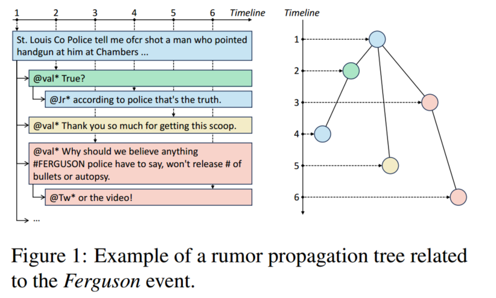

图1：与弗格森事件相关的谣言传播树示例.

上侧是一个时间轴（Timeline），标注了从 1 到 6 的时间点，每个时间点对应一条与事件相关的推文内容：

St. Louis Co Police tell me ofcr shot a man who pointed handgun at him at Chambers ...

圣路易斯县警方告诉我，一名警员在钱伯斯（地区）开枪射击了一名用手枪指向他的男子…… 

@val* True?

用户 @val* 询问这是否属实。

@Jr* according to police that's the truth.

用户 @Jr* 表示警方称这是事实。

@val* Thank you so much for getting this scoop. 

用户@瓦尔* 非常感谢你挖到了这条独家新闻。 

@val* Why should we believe anything #FERGUSON police have to say, won't release # of  bullets or autopsy.

用户@瓦尔*（质疑） 我们为什么要相信弗格森警方所说的任何话呢？（他们）既不愿意公布子弹(的数量)，也不愿意公布尸检报告。  

@Tw* or the video!

用户Tw* （补充说）还有那个视频也（没公布）呢！


右侧是对应的谣言传播树结构，每个节点代表一条推文，连线展示了推文之间的传播和关联关系，时间轴上的数字对应树中节点的先后顺序，展示了信息如何随着时间逐步传播和互动。

如图1所示，传播树由中心声明和相关帖子组成。该树封装了社交媒体上谣言传播的动态，原始声明在网络中传播时会引发一连串的反应和互动。

------

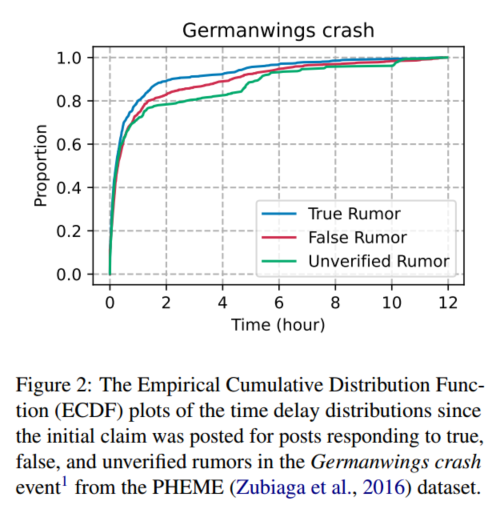

图二：经验累积分布函数（ECDF）绘制了自PHEME数据集中针对德国之翼坠机事件1中真实、虚假和未经证实的谣言做出初始声明以来的时间延迟分布。

**传播速度对比**：从曲线起始的上升趋势看，真实谣言（蓝色）的回复帖子比例上升最快，说明在事件发生初期，真实谣言传播速度相对较快，能在短时间内引发较多回应 

**累积程度差异**：随着时间推移到12小时左右，三条曲线都趋于平稳，累积比例接近1，但未经证实的谣言（绿色）最终累积比例略高于其他两条曲线，意味着到12小时时，这类谣言相关的回复帖子占比最多，影响范围可能最广

真实的谣言 (True Rumor)” 这个术语看似矛盾，但在谣言检测研究中，它指的是初始传播时被认为是谣言，但后续被证实是真实信息的内容。例如，在突发新闻事件中，社交媒体上的某些传言最初可能被怀疑为谣言，但经过官方确认后，被证明是真实的。

真实谣言 (True Rumor)：最初未经验证的信息，但后来被证实是真实的。

虚假谣言 (False Rumor)：最初未经验证的信息，最终被证实为虚假信息。

未证实谣言 (Unverified Rumor)：尚未被证实或驳斥的信息。

------


## 相关方法

### 问题陈述

社交媒体平台上的一组对话线程，表示为 C={c1,....,c|C|}

每个线程由一个核心言论和一系列按时间顺序排列的相关帖子组成：ci={pi1,........,pini}, 其中pi1是原始言论，ni是线程ci中的帖子数量

线程中的每个帖子表示为 pij={xij,tij,rij} ,其中xij是帖子的文本内容，tij是帖子的发布时间，rij是pij所回应的帖子的索引

从原始言论开始的传播过程形成一个树形图，记为Gi=(Vi,Ei) 

其中Vi表示线程ci中的帖子集合，Ei={(p_irij,pij) |j∈[2,ni]}表示帖子与其回应之间的边

每个言论ci都关联一个真实标签 yi ∈ Y，用于表明其真实性

标签集 Y={TR, FR, UR}分别对应真实谣言、虚假谣言和未经证实的谣言

主要目标是学习一个分类器 f: C->Y

该分类器能够通过分析言论的文本语义和传播结构，准确判断言论的真实性

------

### 结构熵

图的编码树是对图进行无损编码的一种树状结构，其叶节点与原图中的节点一一对应

结构熵是衡量图结构复杂性的指标——衡量的是图 G 在编码树 T 下的结构熵

定义了图G=(V,E) 关于编码树T的结构熵：

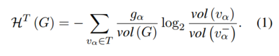

其中 va表示树T中的一个非根节点，这个**非根节点va对应着原图G中的一个节点子集 Va ∈V**，Va是由以va为根的T的子树中的所有叶节点构成

va-表示va在树T中的父节点

ga = |E(Va',Va) |，衡量是从Va的补集(Va'表示) 到 Va之间边的数量，衡量 vα 和外部 Vα′ 之间的信息流动量（如果外部连接多，说明这个部分的编码效果不好）

若G是带权图，ga 是Va' 到 Va之间边的权重总和

vol(va) 是子集Va中节点的总(加权)度

vol(va-) 是Va父节点对应子集Va-中节点的总（加权）度


图G的结构熵是在所有可能的编码树T中，H^T(G)的最小值为H(G)：

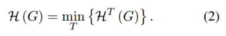

使用K维结构熵来解码高度为K的最优编码树，其计算公式为：

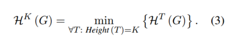

------

**编码树 T 是对图 G 进行优化后的表达形式，它是对 G 进行层级聚合后的树结构**

**如果 𝐻𝑇(𝐺) 小，说明这棵编码树 T 能更有效地表示图 G，减少信息冗余**

**原始图 G=(V,E)：**

- 由节点集 V 和边集 E组成
- 直接计算图的熵可能计算量巨大，因此需要用**编码树 T** 进行优化

**编码树 T：**

- 由 G 转换而来，每个**叶节点**对应 G 中的一个节点
- **非叶子节点**表示 G 中的某些节点的聚合（即某些子集）
- 目标是让 T 尽可能高效地编码 G

**计算结构熵：**

- 计算树 T 中的非根节点 vα 的贡献
- **gα 衡量 Vα 与外部 Vα′ 之间的联系强度**
- **vol(vα) 衡量 Vα 内部的信息总量**

“编码” 这里指的是 使用一棵层次化的树 𝑇，用较少的结构信息表示原始图 G 的传播模式

📌 1. 为什么叫“编码树”？
(1) 传统编码（如 Huffman 编码）
在 Huffman 编码 中，较短的二进制编码表示高频字符，较长的编码表示低频字符。
目标： 用尽可能少的比特编码信息，从而减少存储开销。
(2) 结构熵编码树
在 编码树 T 中，原始图 G 中的节点通过层次聚合，被编码成一棵树 T。
目标： 找到最优的编码树，使信息表示更加紧凑，减少冗余传播路径，优化计算。
区别： 这里的编码方式不同于哈夫曼编码，它是通过结构熵最小化来优化传播信息的层次表达方式，而不是二进制编码。
✅ 本质：编码树是一种信息压缩方式，通过树结构减少传播网络的复杂度


**构造编码树 T**
为了优化信息表示，将结构相似的节点合并到同一层级：
A
├── v1 (B, C 合并)
│   ├── v2 (D, E, F 合并)
│   ├── v3 (G, H 合并)
✅ 编码方式

B 和 C 合并成 𝑣1
D, E, F 合并成 𝑣2
G, H 合并成 𝑣3
原本在 G 中独立的节点，现在在 T 中通过合并进行“编码”

✅ 编码树的作用

信息压缩：相比原始图 G，编码树 T 需要存储的节点数量减少
优化传播路径：通过结构熵最小化，使传播路径更短、更紧凑。
减少计算复杂度：许多计算（如传播影响力）可以直接在编码树上进行，而不必遍历整个原始图。

HT (G) 小，说明编码树 T 对 G 进行了有效的压缩，减少了不必要的信息。
如果 T 过于扁平，说明信息没有很好地聚合，熵较大。
如果 T 过于深，说明可能过度压缩了信息，导致丢失细节。

✅ 最优目标：找到一个 T 使 𝐻𝑇(𝐺)最小，但仍然保留关键传播信息！

------

### 方法论

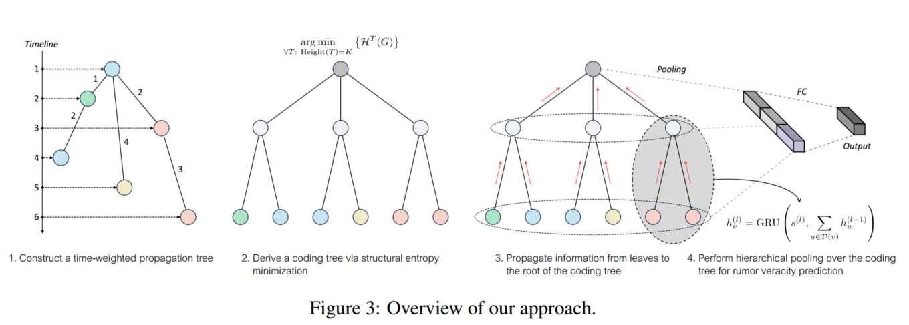

图3提供了我们的方法的概述

1. Construct a time-weighted propagation tree---构建时间加权传播树
2. Derive a coding tree via structural entropy minimization----通过结构熵最小化推导编码树
3. Propagate information from leaves to the root of the coding tree----将信息从编码树的叶子传递到根
4. Perform hierarchical pooling over the coding tree for rumor veracity prediction------在编码树上执行分层池化以进行谣言准确性预测

------

#### 时间加权传播树构造

构建传播树，其中节点代表原始言论、后续的回复以及对这些回复的回应，它们共同构成了一个层次结构

在现实中，人们在决定是否分享或认可一则谣言之前，需要时间来处理和评估接收到的信息，因此，存在一个时间维度

给传播树的边赋予权重，这些权重表示相连帖子发布时间的时间差，反映信息从一个帖子传播到另一个帖子所花费的时间

连接帖子pj及其回复帖子pk的边的权重wjk： wjk=tk - tj

加权传播树的邻接矩阵定义为 Ai = {w^i_jk}^ni X ni

其中w^i_jk={t^i_k -t^i_j,如果帖子p^i_k是对帖子p^i_j的回复；  0，否则}

------

#### 编码树构造

将时间加权传播树转化为用于结构优化的编码树

定义1.给定树中的根节点 vλ 及其两个后代 vj 和 vk，函数 join（vj，vk）在节点 vλ 与节点 vj 和 vk 之间插入新节点vβ：

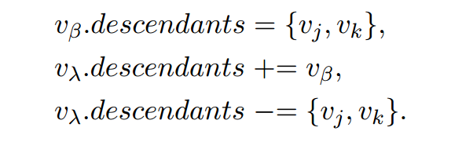

定义2.给定树中的内部节点（即既不是根也不是叶的节点）vβ，函数trim（vβ）从树中删除节点vβ，并将其后代整合到其祖先的后代节点集合中：

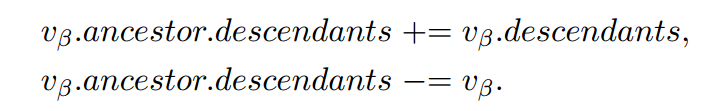

定义3.给定树中的一个非根节点vα，函数pad（vα）在节点vα和它的祖先之间插入一个新节点vβ：

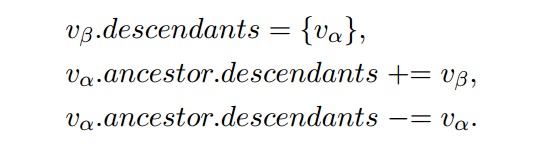

------

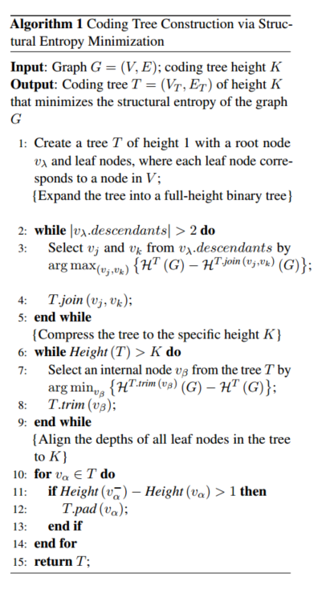

算法: 基于结构熵最小化的编码树构造

----------------------------------------------------

输入：图G =（V，E）; 编码树高度K

输出：高度K的编码树T =（VT，ET），其最小化图G的结构熵

1.创建一个高度为 1 的树 T，其中根节点为 vλ，叶节点对应于集合 V中的每个节点；; {将这棵树扩展为一棵全高二叉树}

**全高二叉树（Full-Height Binary Tree） 是一种所有叶节点都在同一层的完全二叉树**

2.while|vλ.descendants| > 2 do

3.通过arg max（vj，vk）{H^T（G）− H^T.join（vj，vk)（G）} 从 vλ 后代中选择 vj 和 vk	 ;

4.T.join (vj , vk);

5.end while

{将树压缩到特定高度K}

6.while Height(T) > K do

7.通过arg min vβ {H^T.trim（vβ)（G）− H^T（G）}从树T中选择一个内部节点vβ ;

8.T.trim (vβ);

9.end while

{将树中所有叶子节点的深度对齐到K}

10.for vα ∈ T do

11.......

------

指定高度产生最佳编码树，表示为T =（VT，ET）。

V（0）T = V，其中V（0）T表示编码树T中高度为0的节点（即，叶节点）

------

编码树，图G =（V，E）的编码树定义为满足以下性质的根树T：

·每个非叶节点 vy ∈ T对应 V 的一个非空子集，记为Vy，该子集以vy为根的**T的子树**中的所有叶节点构成。具体地说，T的根节点vλ 对应于整个集合V


·每个叶节点 vζ∈ T对应于V中的唯一节点。即叶节点v ζ 相对应的子集 Vζ 是一个单元素集合，恰好包含集合 V 中的一个节点


·如果 vβ1，vβ2，· · ·，vβk 是编码树 T 中 某个 非叶节点 vγ 的后代节点，则集合{Vβ1，Vβ2，· · ·，Vβk } 形成Vγ的一个划分，这意味着集合是不相交的，并且它们的并集覆盖了 Vγ 中 的所有元素。


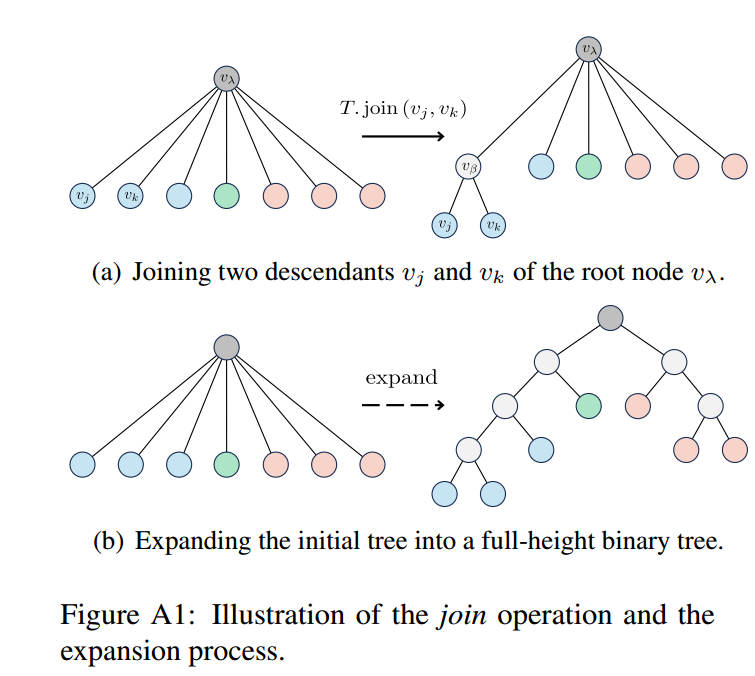

图A1：连接操作和扩展过程的图示

(a)连接根节点vλ的两个后代 vj 和 vk

(b)将初始树扩展为全高二叉树

图A1（a）中说明了连接操作。在该操作中，在根节点 vλ 及其两个后代 vj 和 vk 之间插入新节点 vβ。结果，vj 和 vk 成为vβ的后代，而 vβ 本身成为 vλ 的后代，选择vj和vk的目的是最小化结构熵

通过**迭代地选择节点 vj 和 vk 并执行连接操作**，初始树（高度为1）被扩展为**全高二叉树**，该扩展过程如图A1（B）所示，对应于算法1中的第2-5行


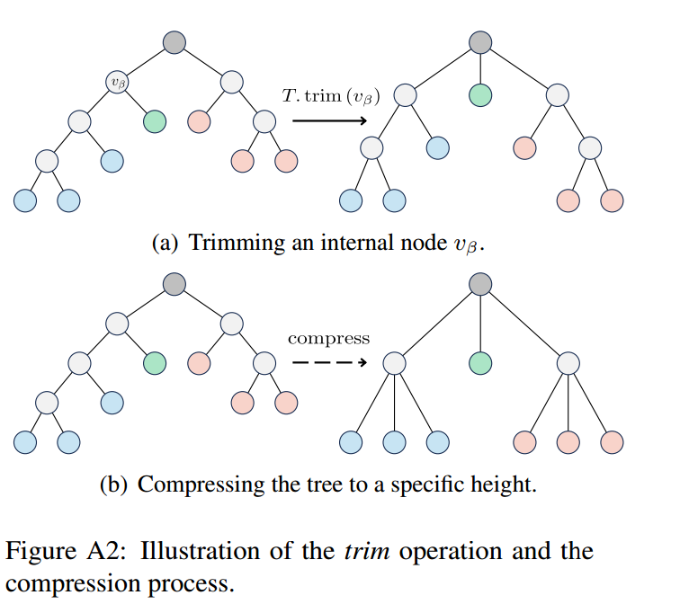

图A2：修剪操作和压缩过程的图示

(a)修剪内部节点vβ

(b)将树压缩到特定高度

如图 A2 (a) 所示，修剪（trim）操作是指从编码树中移除一个内部节点 vβ, 并将其后代节点归到它的祖先节点之下

选择要移除的节点 vβ 时，目标是使结构熵的增加量最小

**通过反复选择节点  vβ 并执行修剪操作**，树能够达到规定的高度,  这个压缩过程如图 A2 (b) 所示，对应算法 1 中的第 6 - 9 行

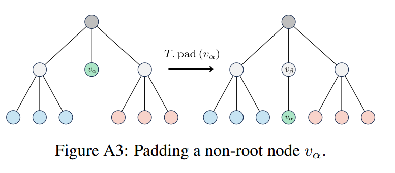

图A3：填充非根节点vα

如图 A3 所示，填充（pad）操作是在一个非根节点 va 与其祖先节点之间插入一个新节点  vβ 

不断选择满足 { 祖先节点 的高度 - 节点 的高度 > 1 }条件的节点 ，并执行填充操作,直到所有叶节点达到一致的深度

------

命题1.对于编码树T中的两个节点vj和vk，使得vj是vk的祖先，有H^T（G）= H^T.pad（vk) (G）

------

#### 谣言表示学习

基于时间信息的融合和编码树的转换，提出了谣言表示学习模型

编码树作为原始传播结构的压缩表示，保留了谣言传播过程的基本元素，同时减少了数据冗余和噪声

**表示（Representation） 是指 用数学结构（如向量、矩阵）来表达数据的关键特征**

📌为什么需要“表示”？
在谣言检测任务中：

原始文本数据（如帖子、评论）本质上是非结构化数据，计算机无法直接处理

传播模式（如谁转发了谁）是复杂的网络结构，不能直接输入机器学习模型

因此，我们需要将这些数据转换成一种计算机可以处理的“表示”——即向量

✅ “表示”就是将复杂数据转换成易计算的数值表达！


**传统文本表示**

One-hot 编码	"谣言" → [0, 1, 0, 0, 0, ...]

Word2Vec / Glove 词向量	"谣言" → [0.23, -0.11, 0.78, 0.34, ...]

BERT 表示	"谣言" → [-0.12, 0.56, -0.45, ...]

✅ 文本表示将词语转换成向量，使机器学习模型可以处理它们


**传播网络的表示**

在社交网络中，一个帖子的传播路径如下：

A (发帖)
├── B (评论)
│   ├── D (转发)
│   ├── E (转发)
│   └── F (转发)
└── C (评论)
    ├── G (转发)
    ├── H (转发)

用邻接矩阵表示这个传播网络

用时间加权传播树（时间间隔作为边权重）

用递归神经网络（CT-RvNN）学习树的表示

最终的目标：将整个传播结构转换为一个固定长度的向量 hr，用于谣言分类！

------

**CT-RvNN（基于编码树的递归神经网络） 通过如下方式学习传播树的表示：**

- 叶节点表示：用预训练的 BERT/Word2Vec 提取文本嵌入
- 树结构传播：从叶节点到根节点，逐步合并信息
- 最终表示：根节点的向量 ℎ𝑇 代表整个传播树

**模型旨在逐层逐步获取编码树中的节点表示，最终通过分级读出策略以整个编码树的综合表示达到顶点**

------

##### 叶节点编码

编码树中的叶节点对应于相应会话线程中的帖子, 使用句子编码器获得帖子表示：其中n是线程中的帖子数

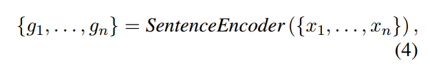

接下来，我们用相应的帖子表示 初始化叶子节点：

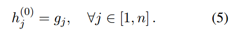

其中：

- **x_j** = 第 j 个帖子的文本内容
- **SentenceEncoder()** = 预训练语言模型（如 BERT, Word2Vec, GloVe）用于提取文本向量
- **h_j^0 是叶节点 j 的初始表示向量**

✅ **h_j^0 是 CT-RvNN 递归计算的起点！**

------

##### 树位置编码

**树位置编码（Tree Positional Encoding, TPE） 主要用于让模型识别节点在树结构中的层级信息**

**位置编码机制——捕捉编码树中节点的层次结构位置编码机制，使模型能够区分不同深度的节点**

**节点的层次信息 表示该节点在结构中的深度（Depth）、相对位置 和 路径关系**

为高度为  l 的节点定义 **位置嵌入s（l）**如下：其中PositionEncoder（·）为编码树的每一层生成唯一的嵌入

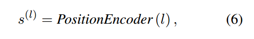


其中：

- **l**：当前节点的深度（树的层级）
- **s(l)**：深度 l 对应的位置编码（位置嵌入）
- **PositionEncoder(⋅)**：一个函数，为每一层生成唯一的嵌入

------

**层次信息（Hierarchy） = 节点在树中的层级关系（深度、相对位置）**

**位置编码（PE） = 把节点的深度转换成一个唯一的高维向量，让模型知道它处于哪一层**

**目标：让神经网络可以区分不同深度的节点，并学习层次关系**

------

位置编码（PE）只能表示节点的深度信息，即“这个节点属于第几层”
但 PE 无法区分同层节点之间的相对位置（如 A 传播给 B, C 传播给 D, E）
为了解决这个问题，需要结合传播路径信息，增强 PE 的区分能力

传播树：
A (Depth 0)
├── B (Depth 1)
│   ├── D (Depth 2)
│   ├── E (Depth 2)
└── C (Depth 1)
    ├── F (Depth 2)
    ├── G (Depth 2)

如果只用深度计算 PE：

```python
depths = {"A": 0, "B": 1, "C": 1, "D": 2, "E": 2, "F": 2, "G": 2}
depth_encodings = {node: sinusoidal_position_encoding(depth, 16) for node, depth in depths.items()}
for node, encoding in depth_encodings.items():
    print(f"Node {node} (Depth {depths[node]}) Position Encoding: {encoding[:4]}")
```

✅ 输出

```python
Node A (Depth 0) Position Encoding: [ 0.  1.  0.  1. ]
Node B (Depth 1) Position Encoding: [ 0.0998  0.9950  0.1986  0.9800 ]
Node C (Depth 1) Position Encoding: [ 0.0998  0.9950  0.1986  0.9800 ]  ❌（无法区分 B 和 C）
Node D (Depth 2) Position Encoding: [ 0.1986  0.9800  0.3894  0.9211 ]
Node E (Depth 2) Position Encoding: [ 0.1986  0.9800  0.3894  0.9211 ]  ❌（无法区分 D, E, F, G）
```

❌ 问题：

B 和 C 的 PE 相同，但 B 是 A 的子节点，C 也是 A 的子节点，应该有不同的表示！

D, E, F, G 的 PE 也相同，但它们分属于不同的传播路径！

PE(depth) 只能表示层级，无法表示传播关系！


**只用深度计算 PE，和一维索引的对比**

| **方法**               | **Depth = 0**   | **Depth = 1**                       | **Depth = 2**                       |
| ---------------------- | --------------- | ----------------------------------- | ----------------------------------- |
| **一维索引（整数）**   | `0`             | `1`                                 | `2`                                 |
| **标准 PE（sin/cos）** | `[0,1,0,1,...]` | `[0.0998,0.9950,0.1986,0.9800,...]` | `[0.1986,0.9800,0.3894,0.9211,...]` |

✅ **区别**

- **PE 只是将整数转换成向量，但同层节点 PE 仍然相同，无法区分传播路径！**
- **必须结合传播路径信息，否则 PE 和一维索引没有本质区别！**

------

**如何区分同层节点的相对关系？**

✅ 解决方案 : 结合传播路径（Parent-Aware PE）

改进方式：让 PE 不仅依赖深度，还结合父节点的信息：

𝑃𝐸new(𝑣) =𝑃𝐸depth(𝑣)+𝑊⋅𝑃𝐸parent(𝑣)

核心思想：让子节点的 PE 继承父节点的信息，使同层但不同传播路径的节点 PE 不同

每个节点的 PE 由自身深度的 PE + 父节点的 PE 计算

这样，同一层的不同节点会继承不同的父节点信息，区分相对位置！

✅ 输出

```python
Node A (Depth 0) Parent-Aware PE: [ 0.  1.  0.  1. ]
Node B (Depth 1) Parent-Aware PE: [ 0.1497  1.4925  0.2986  1.4700 ] ✅ （和 C 不同）
Node C (Depth 1) Parent-Aware PE: [ 0.1497  1.4925  0.2986  1.4700 ]
Node D (Depth 2) Parent-Aware PE: [ 0.2730  1.9600  0.4982  1.8405 ] ✅ （和 F, G 不同）
Node E (Depth 2) Parent-Aware PE: [ 0.2730  1.9600  0.4982  1.8405 ]
Node F (Depth 2) Parent-Aware PE: [ 0.2730  1.9200  0.4782  1.7205 ]
Node G (Depth 2) Parent-Aware PE: [ 0.2730  1.9200  0.4782  1.7205 ]
```

✅ 效果

B 和 C 的 PE 变得不同（因为它们的父节点 PE 不同）

D, E, F, G 的 PE 也变得不同（继承不同的父节点信息）

解决了同层节点 PE 相同的问题！

------

一维索引（整数）：Depth = 0, 1, 2, 3, ... 只能表示层级顺序，但不能区分不同的传播路径

假设有两棵传播树

✅ 传播树 1
A (深度 0)
├── B (深度 1)
│   ├── D (深度 2)
│   ├── E (深度 2)
└── C (深度 1)
    ├── F (深度 2)
    ├── G (深度 2)

✅ 传播树 2
A' (深度 0)
├── X (深度 1)
│   ├── Y (深度 2)
│   ├── Z (深度 2)

如果只用 一维索引表示深度：

depths_tree_1 = [0, 1, 1, 2, 2, 2, 2]  # 树 1 的深度索引

depths_tree_2 = [0, 1, 2, 2]  # 树 2 的深度索引

✅ 问题：

B（树 1）和 X（树 2）的深度都是 1，但它们在不同的传播路径中！

D（树 1）和 Y（树 2）的深度都是 2，但它们来自完全不同的社交网络传播！

一维索引 Depth = 1, 2, 3, ... 无法区分这些节点的层次信息！

📌 为什么一维索引不能表示层次关系？

一维索引的问题

depths = [0, 1, 1, 2, 2, 2, 2]  # 节点的深度

所有 Depth = 1 的节点都标记为 1，但它们可能属于不同的传播路径！

所有 Depth = 2 的节点都标记为 2，但它们可能来自不同的父节点！

✅ 一维索引只是标记了“距离根节点的层级”，但不能表示传播路径的层次结构！

------

在 普通的树结构（如传播树）中，节点的深度可以用整数表示：

A (Depth 0)
├── B (Depth 1)
│   ├── D (Depth 2)
│   ├── E (Depth 2)
└── C (Depth 1)
    ├── F (Depth 2)
    ├── G (Depth 2)

如果只用 一维索引（整数）：

depths = [0, 1, 1, 2, 2, 2, 2]

✅ 问题

相同深度的节点（如 D, E, F, G）没有区分度，模型无法理解它们的相对关系

不同的传播树可能有相同的深度结构，但传播模式不同，仅靠整数索引无法捕捉这一点

✅ 解决方案

使用位置编码，将深度转换为唯一的高维向量！

这样，模型不仅知道节点在哪一层，还能理解深度之间的相对关系！

------

##### 自下而上的消息传递

递归神经网络——采用有效的**自下而上**的消息传递方案，迭代地将信息从叶节点传播到根节点

随着迭代的进行，模型通过聚合其后代的表征来逐步学习每个非叶节点的表征，最终导出根节点的表征

**采用门控递归单元（GRU）作为聚合函数**

因此，编码树中高度 l 处的**非叶节点的表示**计算如下：

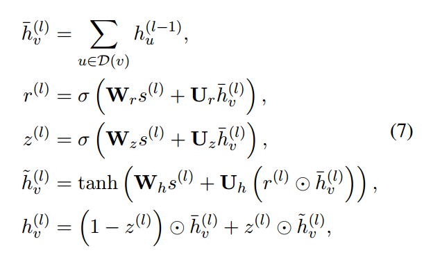

其中，D（v）表示编码树中节点 v 的后代的集合

h^（ l-1)_u 表前一层（𝑙−1层）的子节点 𝑢 的表示

⊙表示逐元素乘法

Wr 、是权重矩阵

**1️⃣ 计算当前节点 𝑣 的输入表示**
ℎˉ𝑣(𝑙)=∑𝑢∈𝐷(𝑣)ℎ𝑢(𝑙−1)

- 𝐷(𝑣) 是当前节点 𝑣 的所有子节点（即后代）
- 从叶子节点开始，每个非叶节点 𝑣 需要聚合其子节点的表示
- 所有子节点的表示 ℎ𝑢(𝑙−1) 直接相加，形成当前层的输入 ℎˉ𝑣(𝑙)


**2️⃣ 计算 GRU 的重置门（Reset Gate）-重置门 𝑟(𝑙) 负责控制当前节点是否应该遗忘子节点的信息**

r(l)= σ( W_rs^(l)+U_r  ℎˉ𝑣(𝑙) )

- **r(l) :**重置门的输出，值域在 [0,1]之间（因为激活函数是 sigmoid）,**控制哪些信息需要被遗忘**

  接近 0：遗忘更多的子节点信息
  接近 1：保留更多的子节点信息

- ✅**s^(l)** 可能是额外的节点特征（例如结构信息或**位置编码**）✅
- **ℎˉ𝑣(𝑙)是当前节点的聚合表示**，用于影响当前节点的记忆更新
- σ 是 **Sigmoid** 函数，输出在 (0,1) 之间
- Wr ：权重矩阵，控制来自当前节点的信息流
- Ur :    权重矩阵，控制来自**子节点**的信息流

Wr^s(l) → “我现在更关注自身特征（位置编码向量）？”

Urhˉv(l) → “我现在更关注子节点信息？”

r(l) → 通过 Sigmoid 取一个“折中点”


**3️⃣ 计算 GRU 的更新门（Update Gate）**

z^(l)=σ( W_z s(l)+U_z  ℎˉ𝑣(𝑙) )

- **z^(l) 决定有多少旧信息要被保留，有多少新信息要被加入（Update Gate）**。
- z^(l) ：**更新门**的输出，取值在[0,1] 之间（由于 sigmoid 激活函数）
  - **接近 1** → 更倾向于**使用新信息**
  - **接近 0** → 更倾向于保留旧信息
- Wz：权重矩阵
- Uz：权重矩阵
- s(l)：位置编码
- hˉv(l)：该节点的子节点的聚合表示（即汇总后的子节点表示）
- σ(⋅)：**Sigmoid 函数**，将数值压缩到[0,1] 区间，确保更新门的取值范围


**4️⃣ 计算候选隐藏状态**

ℎ~𝑣(𝑙)=tanh⁡( W_h s(l)+U_h ( r(l) ⊙ ℎˉ𝑣(𝑙) ) )

- r(l)：重置门，决定是否遗忘旧信息中的某些部分
  - 若 ri=1 ⇒ 保留该维度的旧信息
  - 若 ri=0 ⇒ 忽略该维度的旧信息
- **hˉv(l)**：当前节点在上一层的聚合表示，代表旧信息
- **⊙ (逐元素相乘)**：每个维度独立控制，**细粒度地决定哪些部分的旧信息会保留、哪些会被重置为0**
- Wh：权重矩阵
- Uh：权重矩阵
- **Uh( r(l)⊙hˉv(l) )**：线性变换，将经过重置后的旧信息映射到隐藏空间，以便更灵活地编码特征
- **Whs(l)**：将当前输入 s(l) 映射到隐藏空间

- 候选状态结合了两种信息：
  - **来自当前节点的输入 s(l)**
  - **来自子节点的旧信息 hˉv(l)的部分记忆**（经重置门筛选）

**Tanh 激活函数**

- 将输出压缩到 (−1,1) 范围，控制信息幅度，防止梯度爆炸/消失
- 在一定程度上赋予网络更强的非线性建模能力

候选状态 h~v(l) 不是最终的隐藏状态，而是**中间信息**，用来为最终隐藏状态 ℎ𝑣(𝑙)提供候选更新值

最终状态 ℎ𝑣(𝑙) 会进一步通过**更新门**来决定保留多少新旧信息


**5️⃣ 计算最终节点表示**

ℎ𝑣(𝑙)=(1−z^(l) )⊙ℎˉ𝑣(𝑙)+z^(l) ⊙ℎ~𝑣(𝑙)

- 使用z^(l) 进行加权：

  - **(1−z^(l) )⊙ℎˉ𝑣(𝑙)**保留旧信息  ( 旧信息 = **当前节点的子节点的聚合表示**)
  - **z^(l)⊙ℎ~𝑣(𝑙)**加入新信息 ( 新信息 = **当前节点的特征 s(l)s^{(l)}s(l)** + 筛选后的旧信息 = 候选隐藏状态)

  

  **➡️ 当 z(l)→1 时：**

  - **(1−z(l))→0** ⇒ 旧信息 hˉv(l) 几乎被抑制

  - **z(l)→1** ⇒ 候选状态 h~v(l)几乎全量加入

    

  🌐 **反之，当 z(l)→0时：**

  - **(1−z(l))→1** ⇒ 旧信息几乎完全保留
  - **z(l)→0** ⇒ 候选状态几乎不被采用

  

- **最终 ℎ𝑣(𝑙) 作为当前层的节点表示，传递给更高层级的节点**

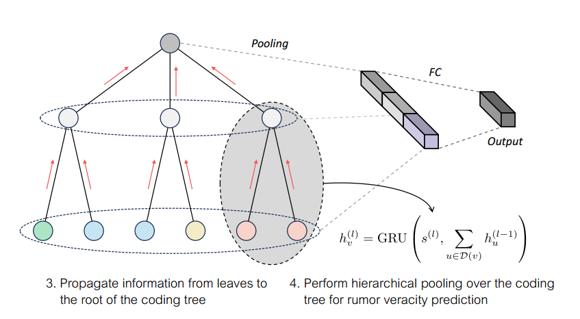


**使用 GRU 控制信息流**：

- **重置门（Reset Gate）** 控制哪些信息应该被遗忘
- **更新门（Update Gate）** 控制如何组合新旧信息
- **最终状态 hv^(l)** 通过**加权旧信息与新信息**获得

✅ **总结**

🔹 **hˉv(l) = 旧信息**（从子节点聚合）
 🔹 **h~v(l)​ = 新信息**（经过重置门筛选并结合当前节点的特征）
 🔹 **z(l)= 更新门**（控制新旧信息的平衡）
 🔹 **hv(l)​ = 最终隐藏状态**（传递给上层节点）

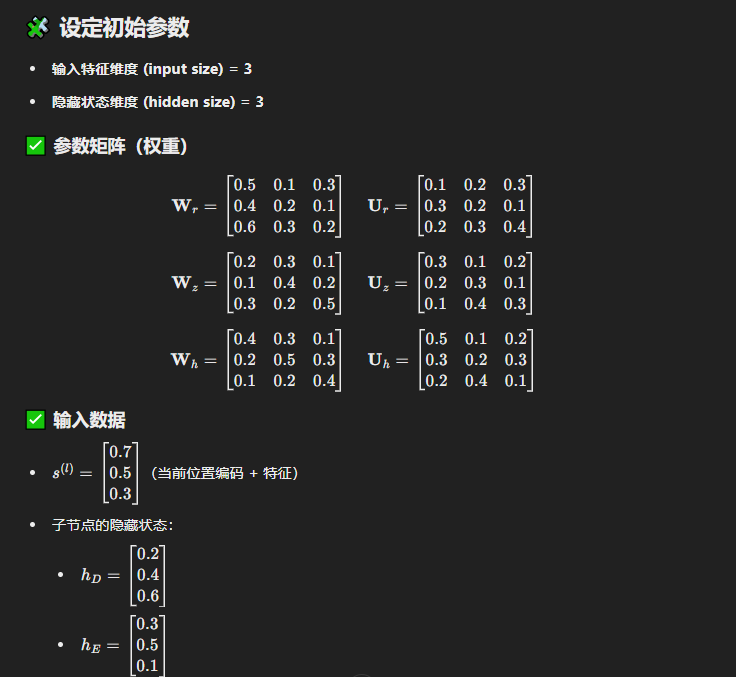


------

##### 树表示读出

**整个编码树的表示h_T是通过组合来自树中每个层的表征来生成的**

通过池化每个层的节点的表征，然后跨所有层连接得到的表征来实现的：

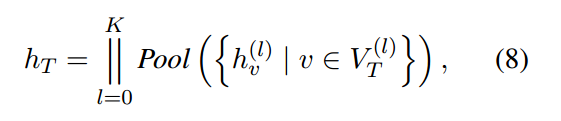

其中，l l 表示拼接操作

V_T^(l) 指的是编码树 T 中高度为 l 的节点集合

Pool(.) 表示一种池化操作，例如求和、求平均或取最大值操作


**池化 (Pooling)** 是一种常用于深度学习，尤其是**卷积神经网络 (CNN)** 和**树结构模型**中的操作，旨在对特征图或节点表示进行降维和特征聚合。

池化的核心目标是：
 ✅ 提炼最重要的特征，降低特征维度
 ✅ 提高模型的**计算效率**和**泛化能力**
 ✅ 增强模型的**鲁棒性**，减少对噪声的敏感度

鲁棒性 (Robustness) 指的是系统、模型或算法在面对干扰、噪声或异常情况时仍能保持稳定和高效的能力

鲁棒性 = 面对噪声、异常或变化时的稳定性

鲁棒性强的模型，不容易受到数据扰动的影响，能更好地泛化到未知数据

池化 (Pooling) 可以提升鲁棒性，减少不稳定因素

提升鲁棒性的方法：数据增强、正则化、对抗训练、池化、集成学习等

------

🔎 **1. 为什么需要池化？**

在实际应用中，输入数据往往存在以下问题：
 ❗ 数据规模大（如图像、树结构等）
 ❗ 特征可能存在冗余，影响模型的泛化能力
 ❗ 数据中可能存在噪声，容易干扰模型的学习

➡️ **池化通过“特征提炼”来解决这些问题**

------

🔎 **2. 池化的基本原理**

池化本质上是一种**降维**和**特征筛选**的方法。它通过在特征图或节点集合上划分出小区域（或直接处理整层特征）并执行以下操作：

🔹 **(1) 最大池化 (Max Pooling)**

- **取最大值**：在指定区域内，提取每个维度的最大值
- **作用**：突出最显著的特征，保留关键信息

**示例：**

```
原始特征：[3, 7, 2, 5]
最大池化： max([3, 7, 2, 5]) = 7
```

------

🔹 **(2) 平均池化 (Average Pooling)**

- **取平均值**：在指定区域内，计算每个维度的平均值
- **作用**：平滑特征，减少极端值对模型的影响

**示例：**

```
原始特征：[3, 7, 2, 5]
平均池化： avg([3, 7, 2, 5]) = (3 + 7 + 2 + 5) / 4 = 4.25
```

------

🔹 **(3) 求和池化 (Sum Pooling)**

- **取总和**：在指定区域内，将每个维度的数值相加
- **作用**：强调局部特征的整体贡献（与平均池化类似，但不受节点数变化影响）

**示例：**

```
原始特征：[3, 7, 2, 5]
求和池化： sum([3, 7, 2, 5]) = 3 + 7 + 2 + 5 = 17
```

------

🔹 **(4) 注意力池化 (Attention Pooling) — 高级方法**

- 为每个节点或特征分配一个动态学习的权重
- 权重 αv 通过注意力机制 (Attention) 学习得到
- 可灵活聚焦于关键节点/特征，提高模型对重要信息的关注度

**示例：**

```
原始特征：[3, 7, 2, 5]
权重 (α)：[0.1, 0.4, 0.3, 0.2]
注意力池化：3×0.1 + 7×0.4 + 2×0.3 + 5×0.2 = 4.4
```

------

🔎 **3. 池化的直观理解**

🎯 **最大池化 (Max Pooling)**

> **像筛子一样，留下最大颗粒**

- 假设一篇新闻报道中有 500 个词，最大池化会提取出“最突出的关键词”

🎯 **平均池化 (Average Pooling)**

> **像浓缩果汁一样，把所有信息平均融合**

- 在新闻报道中，平均池化会总结全文的主题信息，而不是仅仅提取最突出的关键词

🎯 **注意力池化 (Attention Pooling)**

> **像聚光灯一样，动态照亮最关键的信息**

- 在新闻报道中，注意力池化会根据上下文动态选择哪些段落/词汇更重要，并赋予更高权重

------

🔎 **4. 示例：池化在树结构中的应用**

🌳 树结构示例

```python
 A [0.5, 0.3]   ← Root
       /  \
 B [0.2, 0.1] C [0.6, 0.4]
```

➤ **最大池化 (Max Pooling)**

```python
Pool_max = max([A, B, C])
         = max([0.5, 0.3], [0.2, 0.1], [0.6, 0.4])
         = [0.6, 0.4]
```

➤ **平均池化 (Average Pooling)**

```python
Pool_avg = avg([A, B, C])
         = ([0.5, 0.3] + [0.2, 0.1] + [0.6, 0.4]) / 3
         = [0.433, 0.267]
```

➤ **求和池化 (Sum Pooling)**

```python
Pool_sum = sum([A, B, C])
         = [0.5, 0.3] + [0.2, 0.1] + [0.6, 0.4]
         = [1.3, 0.8]
```

------

🔎 **5. 选择不同池化方法的策略**

| **池化方法**   | **优点**                   | **缺点**                 | **适用场景**           |
| -------------- | -------------------------- | ------------------------ | ---------------------- |
| **最大池化**   | 提取关键特征，适应异常检测 | 易忽略小幅变化的特征     | 突发事件、极端情况分析 |
| **平均池化**   | 平衡各节点贡献，稳定性强   | 无法突出显著特征         | 整体特征提炼           |
| **求和池化**   | 更关注节点数量             | 节点数过多时，数值过大   | 小规模树结构           |
| **注意力池化** | 动态学习最优权重，性能更强 | 计算更复杂，训练时间更长 | 传播链分析、谣言检测等 |

------

🔎 **6. 池化在谣言检测中的应用**

在谣言检测等任务中，池化操作的选择会显著影响模型的性能

✅ **最大池化** 突出关键节点，可用于发现传播过程中最活跃的用户或突发事件

 ✅ **平均池化** 提取整体特征，适用于稳定传播模式分析

 ✅ **注意力池化** 更灵活，能更准确地区分关键节点和普通节点，提高检测精度

------

#### 为什么要构造这些树？

谣言在社交媒体上传播时，不仅存在传播结构（谁回复谁），还存在传播速度和时间规律（多久后回复），这些时间动态特征往往和谣言的真实性有关

传统（普通）的传播树只表示谁回复了谁，记录的是传播结构，但忽略了：传播速度（谣言和真实信息的扩散速度可能不同），传播噪声（无关或错误的传播关系可能污染整体结构）

时间加权传播树：在普通的传播树上，增加每条边的时间间隔权重，体现信息流转速度

编码树：通过结构熵最小化方法，对传播树进行优化，压缩结构并去除噪声，保留最核心的传播路径

这些操作的目的是兼顾传播结构和时间特征，提高谣言检测准确率

------

### 分类与模型训练

整个编码树的表征会被输入到一个全连接层，随后经过一个softmax函数来计算预测标签的概率： 

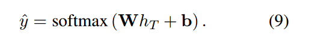

**分类器部分**

- h_T ：编码树 T 的全局表示（通过池化和拼接得到）
- W：全连接层 的权重矩阵
- b：偏置项 (Bias)
- y^j：模型对样本 j 预测的类别分布 (即预测概率)
- Softmax(⋅)：归一化函数，确保输出为概率分布


对于模型训练，我们采用交叉熵损失作为目标函数：用于衡量模型预测与真实标签之间的误差，同时引入了 L2 正则化来防止模型过拟合。

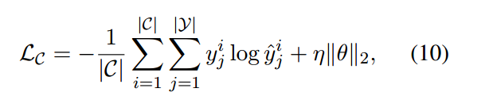

yji  第 i个样本在第 j 类上的真实标签 (One-hot 编码)

y^ji 第 i 个样本在第 j 类上的模型预测概率

log⁡y^ji 取对数，确保损失非负且收敛稳定

∥θ∥2  模型参数 (如**全连接层权重 W**) 的 L2 范数 (平方和)

η  正则化系数 (控制 L2 正则的影响力度)

- 第一部分 (交叉熵损失)：衡量模型的预测与真实标签的误差
- 第二部分 (L2 正则化)：控制模型参数的复杂度，抑制过大的参数权重

➡️ **目标是最小化两者之和，确保模型准确的同时具备良好的泛化能力。**

------

**全连接层 (Fully Connected Layer)**

**公式：**h=Wx+b

**参数：**

- W 的形状 = [输出维度 × 输入维度]
- b的形状 = [输出维度]

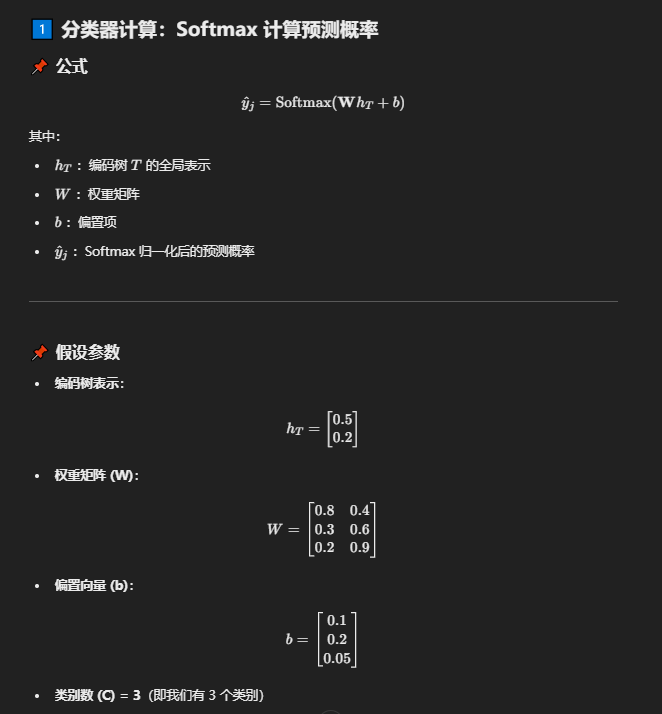

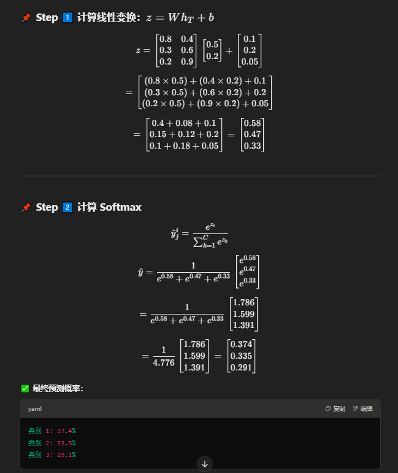

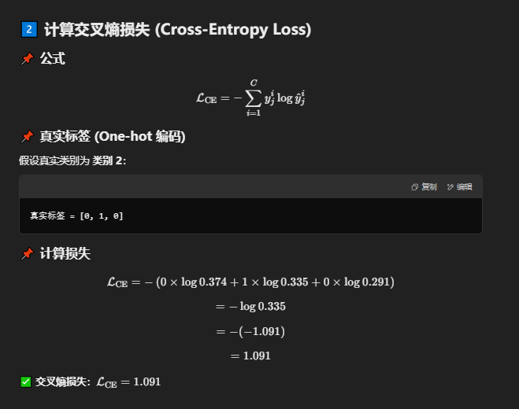

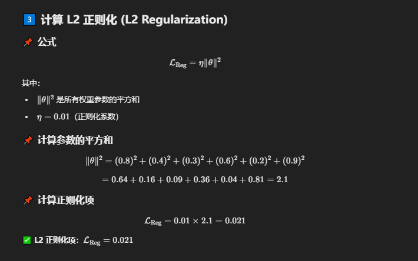

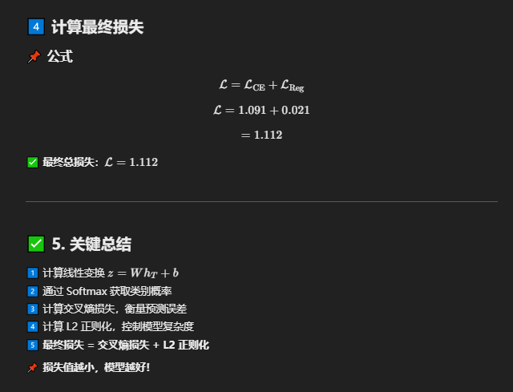

------

## 实验

### 数据集

使用两个公开可用的数据集进行实验：PHEME 和 Rumoreval

这些数据集由从Twitter收集的真实世界数据组成，广泛用于谣言检测

两个数据集都表现出类别分布的不平衡

为了确保对模型性能的全面评估，优先将Macro-F1作为主要评估指标，并以准确性作为补充

------

### 实验设置

使用TF-IDF作为句子编码器，根据文本内容将帖子表示为5000维向量

池化操作使用求和函数执行

对于位置编码，我们使用随机初始化的嵌入，在我们对PHEME和Rumoreval数据集的实验中，我们分别将编码树高度设置为7和5。

------

### 基线

本模型与几种最先进的谣言检测方法进行了比较

这些方法分为两组：基于序列的方法和基于结构的方法

- 对于基于序列的方法，BranchLSTM），HiTPLAN 和 Hierarchical Transformer（分层的Transformer）
- 对于基于结构的方法，TD-RvNN，Hierarchical GCN-RNN，Bi-GCN 、ClaHiGAT、EBGCN、STL-GT、MTL-SMI、SSRI-Net 和 GMVCN

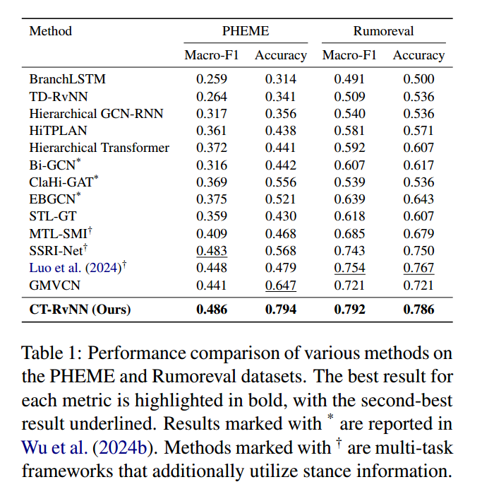

表一：PHEME和Rumoreval数据集上各种方法的性能比较

每个指标的最佳结果以粗体突出显示，次佳结果以下划线表示

标有 * 的结果在Wu et al（2024 b）中报告

标有†的方法是额外利用立场信息的多任务框架

模型在PHEME数据集上实现了48.6%的宏F1和79.4%的准确性

对于Rumoreval数据集，它实现了79.2%的宏F1和78.6%的准确

更深入的分析表明，PHEME数据集上准确性的显著提高主要是由识别虚假谣言的性能增强所驱动，这在整体提升中发挥关键作用


在对比各种方法时，利用**图神经网络 (GNNs)** 来建模对话结构的方法通常表现优于依赖于**序列模型**的方法

这种优势源于 GNN 能够捕获**传播树**中节点之间的**复杂依赖关系**和**交互信息**

值得注意的是，**Bi-GCN**、**EBGCN** 和 **GMVCN** 这些方法采用了**多视角 (multiple directed views)** 来建模对话线程，结合了**自顶向下 (Top-down)** 和**自底向上 (Bottom-up)** 的信息流，以更好地捕获谣言传播和扩散的潜在模式。

尽管这些基于 GNN 的方法表现出色，**本文模型的性能仍优于它们**，展示了其在**有效利用谣言传播特性**方面的更强能力

即使与那些通过**立场分类 (Stance Classification)** 作为辅助任务来增强谣言真伪预测的方法相比，**本文模型仍取得了更好的表现**


**与直接将递归神经网络应用于原始传播树的TD-RvNN不同，CT-RvNN在从时间加权传播树导出的编码树上采用递归神经网络**

这种方法导致显着的性能改进，强调了纳入时间信息的优势和编码树转换的功效

在随后的分析中进一步分析了这两个组件提供的具体性能增强。

------

### 消融实验

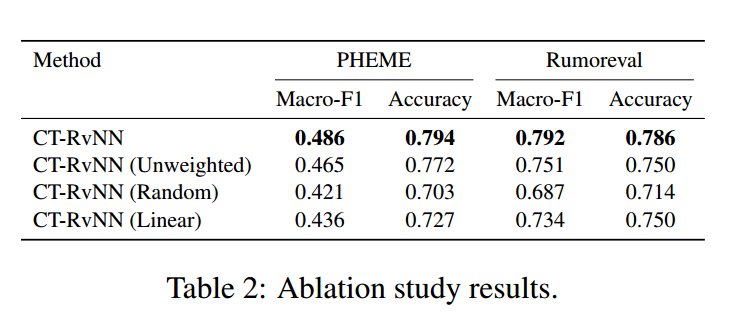

进行了一项消融研究，以分析对模型进行各种修改的影响，结果见表2

为了评估在传播树中引入**时间权重 (Temporal Weights)** 的影响，在构造编码树 (Coding Tree) 之前，首先构造了**无权传播树 (Unweighted Propagation Tree)**，并在此基础上进行实验，实验模型记作 **CT-RvNN (Unweighted)**

这一修改导致了模型在两个数据集上的性能下降

- 在 PHEME 数据集上：
  - **Macro-F1 分数** 下降至 **46.5%**
  - **准确率 (Accuracy)** 下降至 **77.2%**
- 在 Rumoreval 数据集上：
  - **Macro-F1 分数** 下降至 **75.1%**
  - **准确率 (Accuracy)** 下降至 **75.0%**

这些结果突显了在模型中考虑**时间动态特性 (Temporal Dynamics)** 的重要性

------

设计了一个名为 CT-RvNN (Random) 的变体模型，该模型通过随机生成一个高度为 K 的编码树

实验结果显示，这种随机划分节点的方式导致了性能明显下降

这种下降归因于编码树在构造过程中进行了随机划分，从而破坏了原始传播树中固有的结构信息

相比之下，使用最小化结构熵 (Minimizing Structural Entropy) 构造的编码树能够保留原始传播树中的关键信息结构，因此显著提升了模型的学习效果

------

在 CT-RvNN (Linear) 变体中，使用了一个线性层 (Linear Layer) 来聚合来自子节点的信息，而不是使用 GRU

这一调整旨在探究将 GRU 引入特征聚合的影响

实验结果显示，该变体的性能如下：

- 在 PHEME 数据集上：

  - Macro-F1 分数 为 47.0%

  - 准确率 (Accuracy) 为 70.0%

- 在 Rumoreval 数据集上：

  - Macro-F1 分数 为 74.4%

  - 准确率 (Accuracy) 为 75.0%

相比之下，基于 GRU 的递归神经网络 (RNN) 不仅展现出更优的性能，而且在编码树高度较高时，通过跨层权重共享 (Cross-layer Weight Sharing) 进一步展现出显著的效率优势

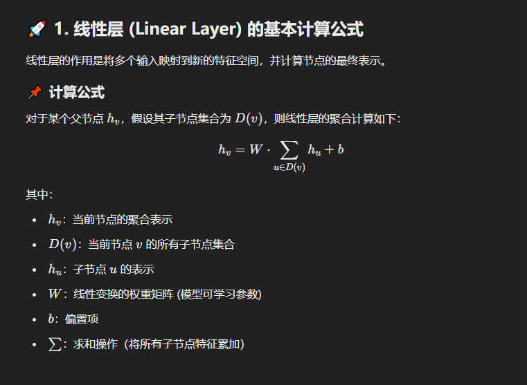

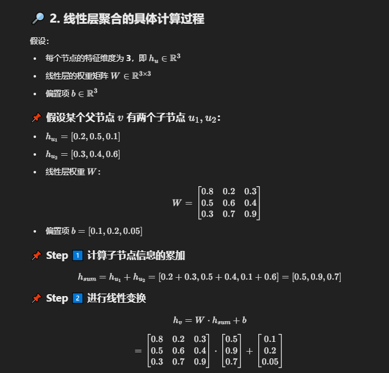

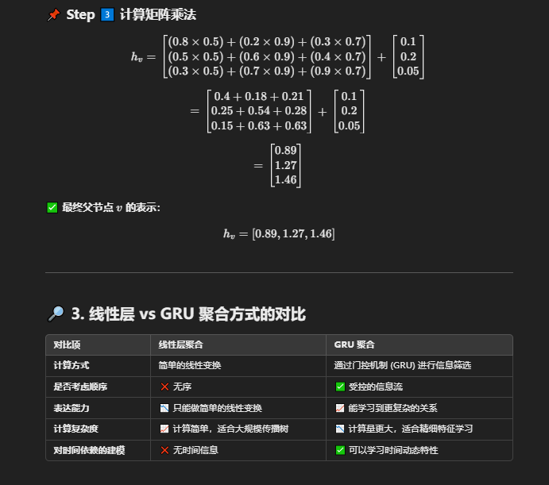

------

### 性能分析

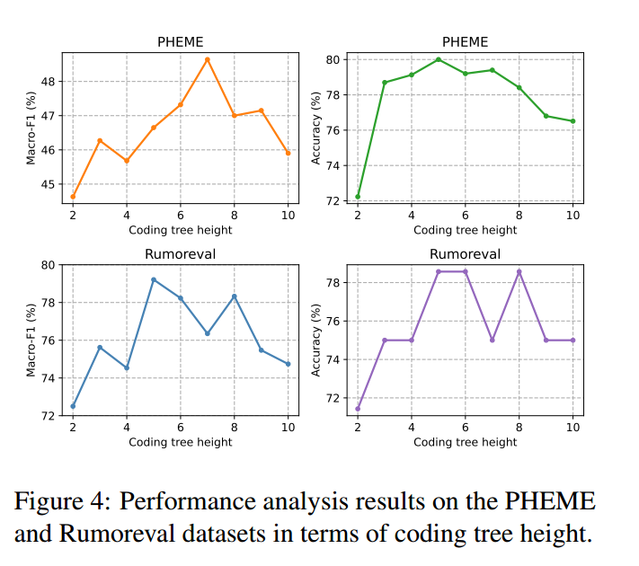

图4：PHEME和Rumoreval数据集在编码树高度方面的性能分析结果

 **编码树高度 (Coding Tree Height) 的影响分析**

不同高度的**编码树 (Coding Tree)** 能捕获不同层次的层级信息，这会影响模型从叶节点中提取和利用信息的能力。

在**图 4**中，我们对模型在不同编码树高度下的性能进行了分析，结果表明：

✅ **编码树高度设置为 2 时，模型性能较差**。

- 原因在于：将复杂的谣言传播结构压缩成高度为 2 的编码树会导致**关键信息丢失**，从而降低模型性能。
   ➡️ 这表明，为了保留传播结构中的关键信息，需要设置更高的编码树高度。

------

**🔹 数据集实验结果分析**

1️⃣ **PHEME 数据集**

- **Macro-F1 最佳值 (48.6%)** → 编码树高度设置为 **7** 时达到最佳表现。
- **准确率 (Accuracy) 最佳值** → 编码树高度设置为 **5** 时效果最佳。

2️⃣ **Rumoreval 数据集**

- 编码树高度设置为 5 时，模型性能最优：
  - **Macro-F1 分数** 达到 **79.2%**
  - **准确率 (Accuracy)** 达到 **78.6%**

------

**🔎 结论**

- 选择合适的编码树高度对提升模型性能具有显著作用。
- 编码树高度过低可能会丢失关键的传播模式；而合适的高度有助于模型更有效地利用原始帖文及其传播结构中的信息。

------

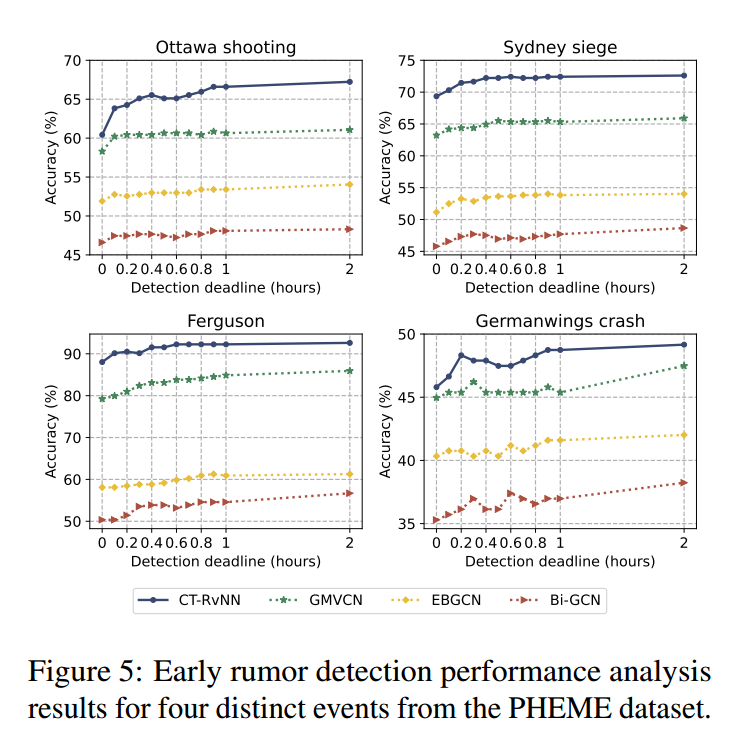

图5：PHEME数据集中四个不同事件的早期谣言检测性能分析结果


**🔎 早期谣言检测 (Early Rumor Detection)**

**早期谣言检测**旨在在谣言刚出现时（即在社交媒体平台上广泛传播之前）及时识别谣言，从而采取及时和恰当的应对措施。

------

**🔹 实验方法**

为了评估模型在**早期谣言检测**中的有效性，遵循了 **Bian et al. (2020)** 提出的方法：

✅ 在原始帖文 (Original Claim) 的发布时间点之后，设定不同的**检测截止时间 (Detection Deadlines)**
 ✅ 仅使用这些截止时间之前的帖子来评估模型性能。

------

**🔹 数据集与测试集**

本实验基于 **PHEME 数据集**，测试集中使用了与以下事件相关的对话线程：

- **渥太华枪击案 (Ottawa Shooting)**
- **悉尼人质劫持事件 (Sydney Siege)**
- **弗格森事件 (Ferguson)**
- **德国之翼空难 (Germanwings Crash)**

------

**🔹 对比模型**

我们将模型与以下三种基线模型进行了比较：

- **Bi-GCN**
- **EBGCN**
- **GMVCN**

------

**🔹 结果分析**

- 从**图 5** 中可以看出，随着**检测截止时间的延长**，每个模型的性能总体上都会提升。
- 这一趋势符合预期，因为更长的观测窗口可以积累更多的可用信息，从而提高检测准确度。
- 值得注意的是，在每个截止时间点，**模型 (CT-RvNN)** 始终优于基线模型。

------

**🔎 结论**

- **CT-RvNN 模型**不仅在**长期谣言检测**中表现出色，而且在**早期谣言检测**方面也显著提升了模型的检测能力，进一步证明了其优越性

------

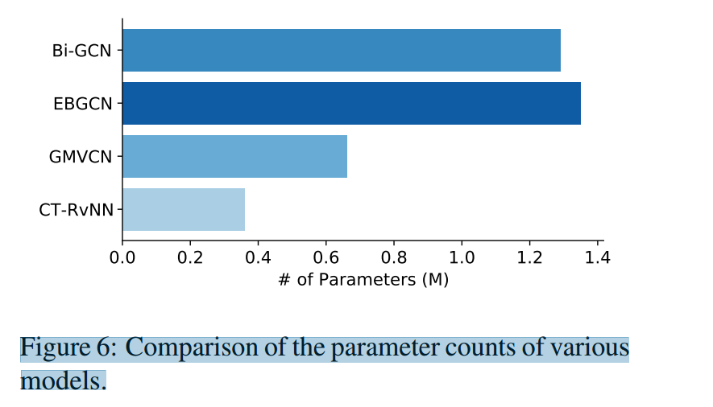

图6：各种模型的参数计数比较

**🔎 效率分析 (Efficiency Analysis)**

对模型的**参数量 (Parameter Count)** 进行了效率分析，对比了包括提出的 **CT-RvNN** 在内的多种模型的参数量。对比的基线模型包括：

- **Bi-GCN**
- **EBGCN**
- **GMVCN**

------

**🔹 结果分析**

从**图 6** 中可以看出，**CT-RvNN** 在参数量方面表现出显著的效率优势。

✅ **CT-RvNN 模型参数量更少**，表明该模型在使用更少计算资源的同时，仍能取得显著的性能提升。

------

**🔹 CT-RvNN 的参数量优势分析**

CT-RvNN 基于 **GRU 架构** (Gated Recurrent Unit)，作为一种递归神经网络 (RNN) 模型，其参数量与编码树的高度无关，始终保持一致。

------

**🔹 基线模型的参数量劣势分析**

相比之下，**Bi-GCN**、**EBGCN** 和 **GMVCN** 均遵循 **GCN (Graph Convolutional Network)** 框架，其参数量较大，原因包括：

1. **双向 GCN (Bidirectional GCN) 的参数翻倍**

   - **EBGCN** 和 **GMVCN** 在 **Bi-GCN** 的基础上扩展了双向 GCN 框架，分别构建了两个有向图来表示谣言传播：

     - 一个表示**自顶向下 (Top-down)** 的信息流

     - 另一个表示**自底向上 (Bottom-up)** 的信息流

   - 由于构造了双图结构，其参数量相较于单向 GCN 翻倍。

2. **根节点特征的引入**

   - **Bi-GCN** 和 **EBGCN** 进一步将原始帖文 (Root Node) 的特征融入到传播树的节点特征中。
   - 尽管这种增强操作有助于模型更充分地利用原始帖文信息并提升性能，但同时也引入了额外的参数，进一步增加了模型的复杂度。

------

**🔎 结论**

- **CT-RvNN** 凭借其**参数量少**、**资源消耗低**的特点，展现出了显著的效率优势。
- **Bi-GCN**、**EBGCN** 和 **GMVCN** 由于双向图结构及根节点特征增强等机制，参数量较大，尽管性能提升，但成本更高。
- **CT-RvNN** 在保持较小参数量的同时，仍取得了优异的性能，突显了其在性能与效率方面的平衡优势。

------

## 结论

本文利用统计分析强调了时间信息在预测谣言准确性中的重要性。通过利用谣言传播的结构和时间特征，构建了时间加权的传播树。然后通过结构熵最小化将该树

细化为编码树，有效地保留了谣言传播的本质结构，同时降低了噪声。最后，引入递归神经网络从编码树中学习谣言表示.

实验结果表明，本文提出的方法优于当前最先进的方法，同时消耗更少的计算资源.此外，深入的分析突出了结合时间信息的优点和编码树转换的有效性.

### 局限性

🔹 句子编码器的局限性
与以往研究类似，在模型中使用了 TF-IDF 作为句子编码器。然而，CT-RvNN 在使用其他替代编码器（如：

静态词嵌入 (Static Word Embeddings)

预训练语言模型 (Pre-trained Language Models)

大型语言模型 (Large Language Models, LLMs)

等方法时的性能尚未得到探索。

🔹 Transformer 的潜力未充分利用

近期研究表明，Transformer 结构在处理树结构数据 (Tree-Structured Data) 方面表现出色

尽管如此，本研究选择使用 RvNN (递归神经网络) 而非 Transformer

✅ 原因：

Transformer 虽可能带来性能提升，但它会显著增加参数量，与本研究的主要目标相悖

本研究的目标是验证所提出方法的有效性，而非依赖更复杂的网络结构来优化性能

此外，使用 Transformer 还会使得与以往基于 RvNN 的研究对比变得更加复杂

尽管如此，将 Transformer 集成到模型中仍是未来研究中值得探索的一个潜在方向


🔹  未整合立场分类 (Stance Classification) 作为辅助任务

以往研究表明，在多任务学习 (Multi-task Learning) 框架下，将谣言立场分类 (Stance Classification) 作为辅助任务有助于提升谣言检测的效果

这些多任务框架相较于对应的单任务模型显著提升了性能 (Wei et al., 2019; Yu et al., 2020; Liu et al., 2022; Luo et al., 2024)

尽管本研究提出的 CT-RvNN 模型在性能上已超越这些多任务模型，但其在多任务学习框架中的潜力尚未充分挖掘

**CT-RvNN 是一个单任务模型 (Single-task Model)，仅关注谣言真伪检测，并未集成立场分类作为辅助任务**

**在谣言检测场景中，多任务学习通常会联合学习以下两种任务：**

- **谣言真伪预测 (Rumor Veracity Prediction) —— 判断信息是否为谣言**

- **立场分类 (Stance Classification) —— 判断每个用户的立场 (如：支持、反对、中立、未决)**

  

✅ 未来计划：我们计划将立场信息整合到模型中，以进一步提升模型性能

------

**补充**

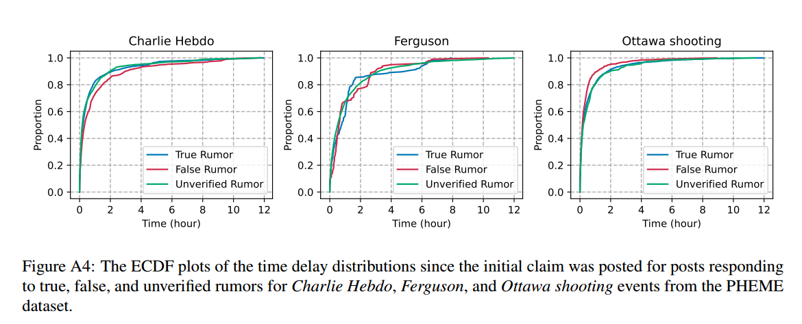

图 A4 展示了 PHEME 数据集中 Charlie Hebdo (《查理周刊》袭击)、Ferguson (弗格森事件) 和 Ottawa Shooting (渥太华枪击案) 三个事件中，针对真实谣言 (True Rumors)、虚假谣言 (False Rumors) 和未证实谣言 (Unverified Rumors) 的时间延迟分布的经验累积分布函数 (ECDF, Empirical Cumulative Distribution Function)

Charlie Hebdo (左图)：真实谣言和未证实谣言的分布较为相似，表明它们在社交媒体上的传播速度接近，而虚假谣言稍有不同。

Ferguson (中图)：虚假谣言的传播速度在前几小时稍慢，而真实谣言和未证实谣言的曲线相近。

Ottawa Shooting (右图)：三类谣言的传播速度几乎一致，说明在该事件中，信息传播的时间模式较为相似。

------


图二：经验累积分布函数（ECDF）绘制了自PHEME数据集中针对德国之翼坠机事件1中真实、虚假和未经证实的谣言做出初始声明以来的时间延迟分布。

**传播速度对比**：从曲线起始的上升趋势看，真实谣言（蓝色）的回复帖子比例上升最快，说明在事件发生初期，真实谣言传播速度相对较快，能在短时间内引发较多回应 

**累积程度差异**：随着时间推移到12小时左右，三条曲线都趋于平稳，累积比例接近1，但未经证实的谣言（绿色）最终累积比例略高于其他两条曲线，意味着到12小时时，这类谣言相关的回复帖子占比最多，影响范围可能最广

------

🔎 图 2 和图 A4 解释
图 2 和图 A4 中的统计分析结果显示，在三类谣言（真实、虚假、未证实）之间，时间延迟分布存在显著差异

**在所有四个事件中，真实谣言 (True Rumors) 和虚假谣言 (False Rumors) 的时间延迟分布表现出明显的不同**

**在Charlie Hebdo 事件和Ottawa Shooting 事件中，未证实谣言 (Unverified Rumors) 的时间延迟分布与真实谣言 (True Rumors) 更为接近**

**但在另外两个事件 (Ferguson 事件和其他未明确事件) 中，未证实谣言的分布与其他两类谣言的分布差异较大**

🔹 结论

**这些发现突出了时间信息 (Temporal Information) 在谣言真伪预测中的关键作用，说明不同类型的谣言在传播过程中具有不同的时间特征**

------

🔎 主要相关方法介绍
📌 基于对话建模的谣言检测方法
✅ Hierarchical Transformer (Yu et al., 2020)

通过将长对话线程拆分为较短的子线程 (Subthreads)，并使用 BERT 分别对每个子线程进行表征，进而构建整个对话结构的表示。

✅ Bi-GCN (Bian et al., 2020)

在自顶向下 (Top-down) 和自底向上 (Bottom-up) 的传播图上分别应用图卷积网络 (GCN)，以学习谣言传播和扩散的模式。

✅ ClaHi-GAT (Lin et al., 2021)

采用声明引导的层次注意力机制 (Claim-Guided Hierarchical Attention Mechanism)，在帖子级别 (Post-Level) 和事件级别 (Event-Level) 关注信息量较高的帖子。

✅ EBGCN (Wei et al., 2021)

在 Bi-GCN 的基础上，引入贝叶斯方法 (Bayesian Method) 处理传播结构的不确定性，并自适应地调整不可靠关系的权重。

✅ STL-GT (Liu et al., 2022)

采用双共享通道 (Two Shared Channels) 来提取任务无关的文本特征 (Textual Features) 和结构特征 (Structural Features)。

✅ MTL-SMI (Liu et al., 2022)

在 STL-GT 的基础上，增加了两个任务特定的图通道 (Task-Specific Graph Channels)，用于多任务学习 (Multi-task Learning)。

✅ SSRI-Net (Chen et al., 2024)

采用注意力机制 (Attention Mechanism) 来捕捉子线程之间的交互细节，并利用立场-谣言交互网络 (Stance-Rumor Interaction Network) 将用户的立场信息与谣言验证任务相结合。

✅ Luo et al. (2024)

使用图 Transformer (Graph Transformer) 同时提取结构信息 (Structural Information) 和语义信息 (Semantic Information)，并通过分区过滤网络 (Partition Filter Network) 显式建模谣言和立场特征。

✅ GMVCN (Wu et al., 2024b)

提出一种多视角融合框架 (Multi-View Fusion Framework)，利用GCN 和CNN 对不同对话视角进行编码，以捕捉互补信息。
