# 获取 TASTE： 结合文本和结构嵌入的多模态立场检测

Acquired TASTE:Multimodal Stance Detection with Textual and Structural Embeddings

**第 31 届计算语言学国际会议论文集，COLING 2025  人工智能B类会议**

立场检测在实现广泛的下游应用方面发挥着关键作用，从话语解析到追踪假新闻的传播和否认科学事实。

引入了TASTE——一种用于立场检测的多模态架构，**基于transformer的文本嵌入**与**无监督结构嵌入**和谐地融合在一起。通过对预训练的变压器进行微调，并通过门控残差网络（GRN）层与社会嵌入融合，模型熟练地捕捉了内容和会话结构之间复杂的相互作用，以确定立场。TASTE在普通基准测试中取得了最先进的结果，显著优于一系列强大的基线。比较评估强调了社会基础的好处，强调了同时利用内容和结构来增强姿态检测的重要性。

------

立场检测是识别说话者对目标（个人、想法、命题）的态度的任务

一个典型的例子：给定一个话语 U（“政府就像一种假装能自我治愈的疾病”）和一个目标 T（普及医疗保健）

希望确定说话者在话语 U 中表现出的立场，尤其是对目标 T 的态度。需要注意的是，目标 T 并没有在说话者的话语中明确提到。

------

## 早期立场检测

1.通过识别特定的词汇形式来解决立场检测问题

------

## 相关方法

### 任务定义

图1：讨论树的插图，其对应的说话人交互图，以及使用最大切割SDP嵌入的派生说话人。节点颜色对应扬声器。树节点代表话语；图节点代表说话人。边宽对应于相互作用的数量。演讲者的嵌入位于一个n维球体上，并通过投影到一个随机的超平面（虚线）上被舍入为离散值。

图1展示了讨论树、相应的说话者交互图以及通过最大割半定规划（SDP）得到的说话者嵌入之间的关系

- **讨论树**：树节点代表话语，不同颜色的节点对应不同说话者。在实际对话场景中，讨论树可呈现对话的先后顺序和逻辑层次，像A说话者的话语节点会先于回应它的B说话者的话语节点出现，从而构建起对话的脉络。 
- **交互图**：由讨论树转换而来，图中节点代表说话者，边e_ab表示节点A和B之间存在直接交互，边的宽度对应交互数量，如w_ab由回复和引用数量决定。以4Forums数据集为例，在某话题讨论中，若A与B频繁回复、引用彼此，那么代表他们的节点间的边就会更宽，直观反映出二者交互的紧密程度。
-  **说话者嵌入**：通过最大割SDP计算得出，在一个72维的球面上，最终通过投影到随机超平面（图中虚线）取离散值。这一过程基于最大割的优化目标，将说话者之间的观点差异转化为向量空间中的距离。比如，立场差异大的说话者，其向量在空间中的距离会被训练得更远，为后续立场检测提供结构化的特征表示。 向量g和 a 之间的夹角相对较大，在向量空间中，夹角越大通常意味着两个向量的距离越远，所以可以推测 g和a代表的说话者立场差异可能较大 。

------

给定一组参与讨论的说话者A，集合U^a = {u ^a_ 1,u ^a_ 2，…， u ^a_ n}  表示a∈A在整个过程中产生的话语

其中每个话语u^a_ j和说话者a都有一个标签y_j,a

y_a∈{+,−}（赞成，反对）

解决两个不同的立场预测任务：话语层面和说话者层面

**在话语层面**，学习一个分类器 σ（u ^a_ j，·）= y^_a,j，使某个损失函数 L( y_j,a, y^_a,j)最小化

σ中的点表示分类器 除了话语之外可能获取的额外输入

这个额外的输入是讲话者的交互图（见图1）,在其他情况下，它可以是元数据，如讲话者的年龄、性别等。

**在说话者层面，如果说话者在整个讨论过程中持有预先形成且稳定的立场**

**则可给说话者分配立场标签（在数据集中类似辩论的讨论中，本质上就是这种情况）**

在这种情况下，任务是训练一个分类器σ（u ^a，·）= y^_a

将一个用户的所有话语输入到分类器中，同时还会输入额外数据（交互图）

------

### 模型体系结构和组件

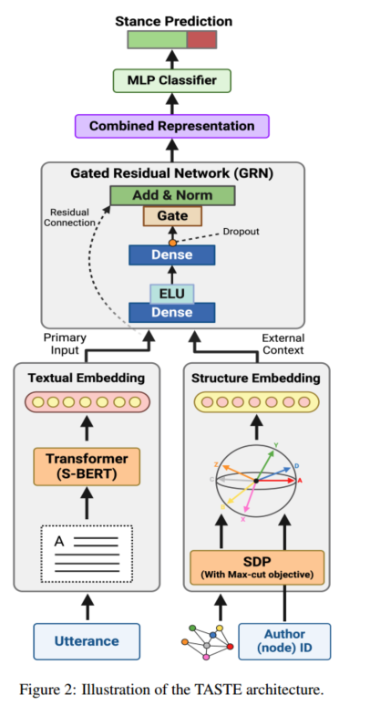

combined representation-组会表示

图 2：TASTE 架构示意图

图 2 所示的模型是话语层面的分类器。它接收两种模态作为输入：文本模态和结构模态

文本模态是话语的嵌入，结构模态是说话者的嵌入

两种嵌入通过门控残差网络（GRN）单元进行融合，采用联合融合策略，在学习过程中动态地结合这两种模态，以便更好地捕捉内容和对话结构之间的相互依赖关系。融合后的表示输入到多层感知器（MLP）分类器中，该分类器输出一个向量，量化标签集 中每个标签t 的可能性，二元预测结果就是可能性最大的标签。

说话者的立场是通过将他们所有的话语输入模型（图2），分别获得每个话语的预测，并获得多数投票来计算的。

------

#### 文本（话语）嵌入（textual enbedding)

文本嵌入，具体来说就是**话语的文本特征提取**

话语u的表示直接来自预训练模型。具体来说，u的内容嵌入 u是通过将 输入到预训练的 SentenceBERT中提取的 [CLS] 标记向量得到的。

SentenceBERT 是专门为生成句子嵌入优化的预训练模型，把需要处理的话语输入 SentenceBERT，利用其已经学习到的语言知识和模式，来提取话语的特征。

把话语输入 SentenceBERT 后，模型会对每个词进行编码，[CLS] 标记位于句首。它的向量表示会综合整句话的语义信息，包含话语的主要内容和特征。将话语输入预训练的 SentenceBERT 后，提取出的 [CLS] 标记向量，就作为该话语的内容嵌入 ，后续可以用于立场检测等任务。

文本嵌入是把文本（话语）转换为向量形式，让计算机能够理解和处理文本信息的技术。

向量是一组数字，文本嵌入能将文本的语义和特征用这些数字表示出来。比如 “苹果” 和 “香蕉” 两个词，通过文本嵌入，能以向量形式呈现它们在语义上的相似或差异，便于计算机分析。

**详细TASTE 模型中文本特征提取过程：**

1. **输入文本及预处理**

   假设用户发言为 “一次性塑料用品污染环境，应被禁止”。首先对文本进行分词，得到词序列 [“一次性”, “塑料”, “用品”, “污染”, “环境”, “应”, “被”, “禁止”] 。然后将词转换为模型能处理的数字表示，比如通过词表映射，假设 “一次性” 对应 ID 为 10，“塑料” 对应 ID 为 25 等。

2. **词嵌入**

   进入 S - BERT 模型，模型会为每个词 ID 生成初始的词嵌入向量。假设每个词嵌入向量维度是 5，“一次性” 的初始词嵌入向量可能是 [0.2, 0.1, -0.3, 0.4, 0.1] ，“塑料” 的初始词嵌入向量是 [0.1, 0.3, 0.2, -0.1, 0.2] ，以此类推，形成一个词嵌入矩阵，维度为（词数，词嵌入维度），这里是（8，5）。

3. **自注意力机制计算**

   自注意力机制通过**计算注意力分数来衡量每个词与其他词的关联程度**。计算过程如下：

   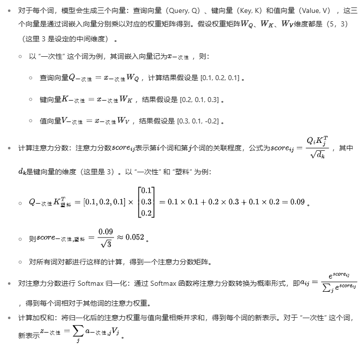

   

   “一次性” 的初始词嵌入向量 [0.2, 0.1, -0.3, 0.4, 0.1] 是该词在 S - BERT 模型生成的低维语义空间中的数学表示
   向量中的每个维度都编码了 “一次性” 这个词的部分语义信息，不同维度的数值共同构成对该词语义的描述。这些数值是模型在大规模语料训练过程中学习得到的，反映了 “一次性” 与其他词在语义上的关联和差异 。例如，与 “一次性” 语义相近的词，它们的词嵌入向量在某些维度上的数值可能比较接近。
   这个 5 维向量的每个维度可以看作一个特征维度。虽然很难确切指出每个维度具体代表什么语义特征，但可理解为有的维度可能与时间特性相关，有的可能与用途特性相关等。比如，0.4 这个值所在的维度可能与 “一次性” 用品使用时间短这一特性有一定联系。
   在整个词嵌入向量空间中，不同词的向量之间的距离和相对位置反映了它们的语义相似度。“一次性” 的词嵌入向量与 “一次性筷子” “一次性纸杯” 等词的向量在空间中距离较近，因为它们语义相关；而与 “永久性”“反复使用” 等词的向量距离较远。

4. **多层 Transformer 处理**

   经过自注意力机制得到的词表示会进入多层 Transformer 结构进一步处理。每一层 Transformer 都会重复上述自注意力计算以及一些前馈神经网络操作（如全连接层、激活函数等），不断更新词表示，让其更好地融合上下文语义信息(**“融合上下文” 指的是模型在处理文本时，不仅仅考虑单个词本身的含义，还综合考虑这个词周围其他词的信息，以此来更全面、准确地理解该词在特定语境中的语义,具体来说就是将归一化后的注意力权重与对应词的值向量（Value）相乘并求和，得到 词融合上下文信息后的新表示**)。

5. **话语（句子）嵌入生成**

   经过多层 Transformer 处理后，对所有词的最终表示进行某种方式的整合（如取平均值、最大值等），得到一个固定维度的**句子嵌入向量**，例如 [0.4, -0.2, 0.3, 0.1, 0.2] ，这就是提取到的文本特征向量，后续会用于和结构嵌入融合以进行立场检测。

------

#### 结构与说话者嵌入(structure embedding)

将讨论树转换为交互图:每个节点代表一个说话者，节点 a和 b之间的边e_ab 表示他们之间存在直接交互。

 **w_ab 表示边 e_ab 的权重，由交互的数量和类型决定**。交互图中的边权重计算如下：

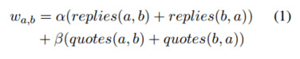

其中，回复replies（a, b）和引用quotes（a, b）表示说话者a和b之间直接回复和引用数量

超参数α和β用于反映交互类型的重要性

对于4Forums数据集，其中交互通常包括对原始帖子（OP）的直接回复和对相关内容的选择性引用，发现最佳值为α = 0.02和β = 1

相反，对于CreateDebate， α被设置为1.0，β被设置为0.0，反映了该平台中引用的使用频率较低

- 交互频率：某个说话者是否频繁与其他人互动，表明他可能是对话中的关键人物。
- 引用关系：一个说话者是否经常引用其他人的观点，可能反映了他依赖或反驳别人意见的倾向。
- 互动强度：如果某个用户经常与持不同立场的人互动，这可能暗示他立场较强或有更强的立场表达。

交互频率（回复和引用次数）会影响边权重，**边的权重就大，形成了重边连接**

一般来说，立场相同的用户之间交互可能更频繁，立场相反的用户交互可能伴随着激烈争论，这些都会反映在边权重上。

说话者嵌入的训练目标是**最大化由重边连接的说话者之间的距离**，重边往往意味着更紧密的交互，而持有相反立场的用户在紧密交互时，**其观点的差异更显著，即向量距离越大**。通过最大化这种距离，结构嵌入可以有效区分不同立场的用户。

节点 a 和 b之间的观点差异可以用两个向量之间的距离度量d来编码, d(a,b)=(1-(a,b))/2

d 的最大值为 1（对于方向相反的向量 / 立场），d最小值为 0（当  a=b时，表示相同立场）

引出了针对所有交互**说话者对**的以下优化问题：

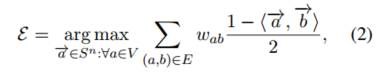

式中→a和→b分别为说话者a和b的单位向量嵌入，s^n为n维单位球面（n为说话者数量）

V是所有说话者的集合，向量a（代表说话者a的单位向量嵌入）必须在n维单位球面上

（a,b)∈E代表a和b之间存在交互，E是所有交互边的集合

**<a,b>表示向量a和b的内积，内积越大，两个向量越相似,(1-(a,b))/2就越小，即两向量距离越小，意味着差异小**

argmax：表示 要找到一组满足约束条件的向量a（对于所有说话者a），使得优化目标达到最大值

**在模型训练场景里，向量a和b不是固定不变的,优化问题目的是找到向量a,使得目标函数取最大，在训练过程中，会运用一些算法（如椭球法求解半定规划问题）不断调整向量a和b的值。每一次迭代计算中，根据算法规则，向量a和b的各个维度数值可能会发生变化，进而导致<a,b>内积改变，最终使得距离d(a,b）也发生变化。**

**在模型训练时改变向量值，并非改变说话者真实的立场，而是让向量在空间中的位置更合理，以区分不同说话者的立场。例如在一个关于 “是否支持某项政策” 的讨论中，有支持和反对两种立场。初始时，代表不同说话者的向量在向量空间中的分布可能比较杂乱，无法清晰体现立场差异。通过优化向量值，让支持该政策的说话者向量聚集在一起，反对的说话者向量聚集在另一处，这样就能在向量空间中明确区分不同立场。**

在训练过程中， TASTE 模型中，使用半定规划（SDP）和椭球法等算法求解优化问题，通过不断迭代寻找**最优解**。在这个过程中，模型会根据**数据中的交互信息和立场标签**，学习到不同交互模式所代表的立场关系。**对于立场相同的用户，他们的交互信息在模型训练过程中会形成特定的模式和规律，模型会根据这些规律调整嵌入向量，保持立场相同用户之间的距离相对较近，同时最大化立场相反且重边连接的用户之间的距离。**

**最大化目标函数，能让重边连接（交互频繁）的说话者的向量在向量空间中的距离尽可能大，以此区分不同立场的说话者。**

**详细例子计算：**

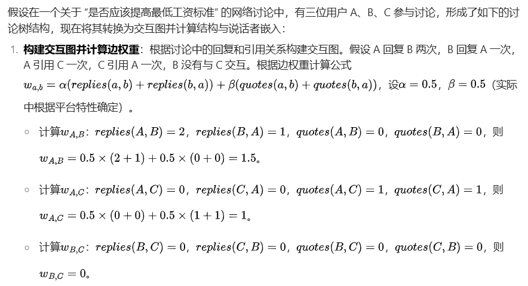

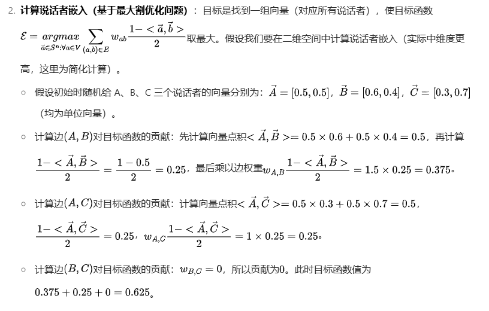

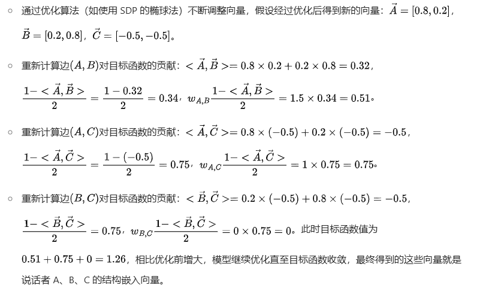

在确定初始时给 A、B、C 等说话者随机向量的维度时，需要综合考虑多方面因素，这些因素会相互影响，最终确定一个合适的维度值。

数据集规模和复杂度是影响向量维度选择的关键因素之一。如果数据集包含大量的说话者以及丰富多样的对话关系，那么需要较高维度的向量来捕捉这些复杂信息。在一个包含数万个说话者，且他们之间存在错综复杂交互关系的大型论坛数据集里，低维度向量难以充分表达每个说话者在庞大对话网络中的独特位置和关系特征，此时可能需要设置几十维甚至上百维的向量。相反，对于规模较小、对话关系简单的数据集，较低维度的向量（如 10 - 20 维）或许就能有效表示说话者的特征。像一个仅有几十人参与，且对话模式单一的小型讨论组数据集，低维向量足以涵盖其结构信息。

**使用 SDP（半定规划）的椭球法优化向量例子：**

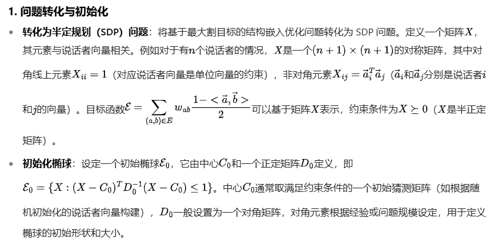

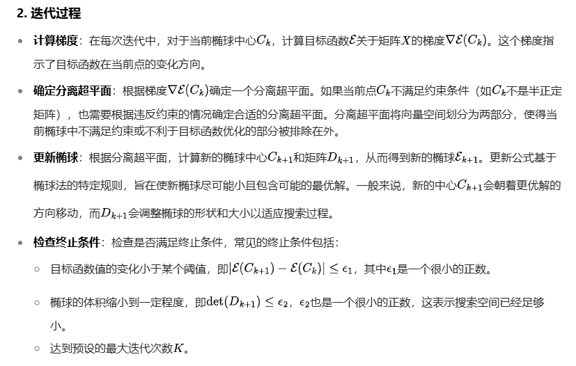

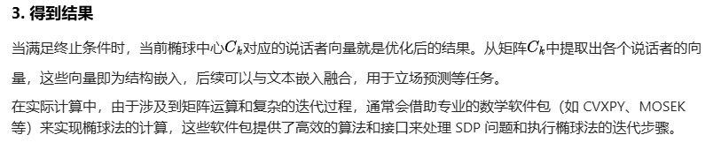

------

### GRN：话语与结构融合

门控残差网络（GRNs）提供了一种创新的方法，用于将**主输入向量**与**多个**相关性可能不同的**上下文向量**进行整合

**在立场检测任务中，主输入向量和上下文向量携带了不同维度的信息，通过 GRNs 融合后，模型能获得更全面、丰富的特征表示（向量），进而更准确地判断说话者的立场**

在处理相对较小且含有噪声的数据集时，GRNs 特别有效。因为 GRNs 能够通过门控机制，选择性地整合信息。对于噪声数据，它可以减少噪声信息的影响，只让对模型有帮助的信息通过，从而提升模型在这种数据上的表现

在其基本形式中，GRN 单元处理一个**主输入向量 a**以及一个**上下文向量 c**：

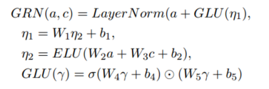

GRN(a,c) 表示GRN单元的输出是经过归一化处理后的**主输入向量a与经过门控线性单元(GLU)处理后的n1之和**，LayerNorm是归一化处理

n1是由n2经过线性变换得到的，其中W1是权重矩阵，b1是偏置项，这一步调整了n2的特征表示

n2是将**主输入向量a和上下文向量c经过加权求和**后，再通过**指数线性单元（ELU）**激活得到的。ELU 激活函数可以引入非线性，增加模型的表达能力，让模型能够学习到更复杂的特征

GLU(y)表示门控线性单元（GLU）通过将**输入y**经过两个不同的线性变换后，一个经过 sigmoid 函数σ得到门控信号，另一个保持不变，然后将两者按元素相乘。这种操作可以根据输入的情况，自适应地调整信息的传递，决定哪些信息可以通过门控进入后续的计算。

**选择以说话者的话语嵌入为主要向量，说话者(结构）嵌入为上下文，通过GRN进行融合**（以结构嵌入为主要向量，以文本嵌入为上下文得到次优结果，表明在该立场检测任务中，将说话者的话语嵌入作为主向量，更有利于 GRNs 发挥作用，融合两种模态的信息，进而提升模型在立场检测任务上的性能。）

将文本嵌入向量和结构嵌入向量作为 GRN 的输入，首先分别经过两个独立的全连接层（Dense）。全连接层会对输入向量进行线性变换，其**目的是调整向量的维度和权重分布，使两种不同来源的嵌入向量在特征空间中的表示更适配**后续融合操作。

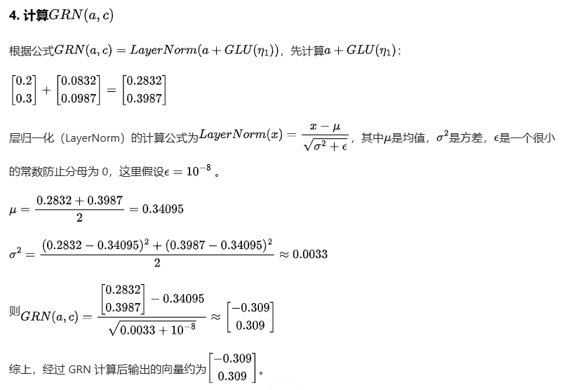

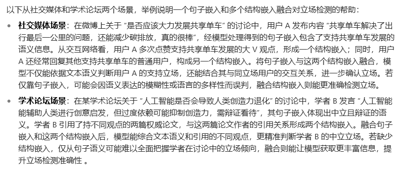

------

## 实验

### 数据集

两个不同的数据集：4Forums、CreateDebate

4Forums（现已停止运营）是一个政治辩论平台。该数据集包含了 202 场关于四个主要议题（堕胎、进化论、同性婚姻和枪支管制）的辩论中的同意 / 反对立场标注。标注是在用户层面进行的。话语的黄金标签是通过将作者的标签应用到其发布的内容上获得的。

CreateDebate 是一个在线平台，被开发用作 “一种通过在线辩论使决策过程民主化的社交工具”。用户（即 “发起者”）通过提出一个问题（例如，“堕胎是否应该合法化：是或否？”）来发起一场辩论。其他用户可以通过添加支持、反驳或澄清信息来回应发起者或其他用户。哈桑（Hasan）和吴（Ng）在 2014 年推出了一个包含 200 场关于四个议题（堕胎、同性恋权利、大麻合法化和奥巴马相关话题）辩论的基准数据集。辩论参与者的自我标注为话语层面提供了黄金标签。用户最常自我标注的标签被用作该用户的黄金标签。
注 1：实际上，超过 95% 的用户会用相同的标签自我标注他们所有的话语。

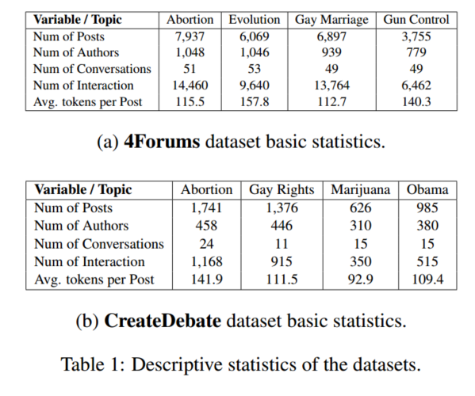

------

### 基线对比

其他四个：基于文本、结构或两者结合的模型

- STEM 和 SDP：STEM 算法一种仅使用**对话结构**的立场分类算法，核心是基于公式（2）中的半定规划（SDP），并在多个数据集的说话者层面立场检测中展现出卓越的结果

  分三步进行：第一步是计算对话图的 2 - 核；再在 2 - 核上计算 SDP 嵌入，并从向量中得出说话者分类；最后，以贪心的方式将标签传播到图的非核心部分

  从 SDP 向量嵌入推导说话者标签是通过超平面舍入完成的。图 1（右侧）展示了说话者向量在 n 维球面上的几何定位
  为了简化，我们将 STEM 的简化版本称为 SDP，它跳过 2 - 核计算，直接将 SDP 应用于整个图，标签通过超平面舍入技术得出

- PSL：概率软逻辑（PSL）方法，将一阶逻辑的表达能力与图形模型的概率建模能力相结合。它允许灵活地指定数据中复杂的关系结构和依赖关系，使其非常适合立场检测等任务。PSL 将问题表述为联合概率推理任务，目标是根据观察到的数据（如文本特征）推断未观察到的变量（如立场标签）的最可能值。

- S-BERT：Sentence-BERT 是 BERT 模型的一种修改版本，专门为**句子嵌入**而设计。

  Sentence-BERT 通过在连体和三元组网络架构上对 BERT 进行微调，使其能够学习更好的句子嵌入。这些嵌入能够捕捉句子之间的语义相似性，使其在各种自然语言处理任务中（如句子分类、语义搜索和聚类）很有用。在需要理解句子级语义的任务中，S-BERT 已被证明优于传统的 BERT 嵌入。

- Global：全局嵌入模型，利用在线辩论中的文本和结构信息来创建统一的全局嵌入。与传统方法可能单独处理文本和结构不同，该方法捕捉了说话者贡献与更广泛对话背景之间的微妙相互作用。**该方法在考虑结构和文本信息方面与本研究方法相近，但其模型将这两个维度整合到一个单一的全局嵌入中，这与本研究分别生成文本和结构的不同嵌入的技术形成对比。**

------

### 训练

使用 AdamW 优化器对 TASTE 模型进行训练，最大训练轮数为 10 轮，批量大小为 16

采用学习率衰减策略，初始学习率在范围内。每三次训练轮次中，如果验证损失没有改善，学习率就会减半。当学习率降低到最低阈值，或者达到最大训练轮数 10 轮时，训练终止

为了避免数据泄露，确保同一作者的帖子不会同时出现在训练集和测试集中

在训练和测试过程中，使用谷歌的 co-lab 环境和 T4 GPU

训练每个 TASTE 模型版本，以及运行每个实验，平均耗时不超过两小时

------

## 结果与分析

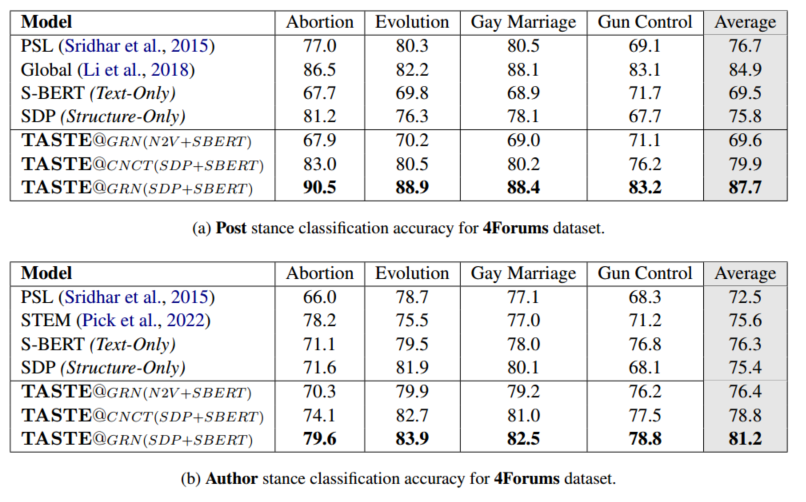

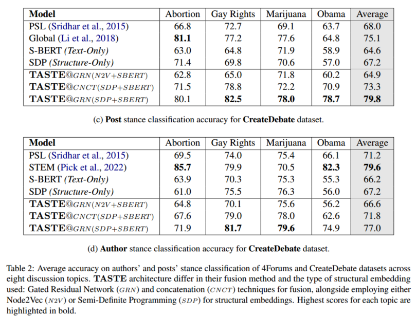

表 2（a - d）比较了 TASTE 模型和基线模型在两个基准数据集上的话语和用户层面的表现，涵盖了多个主题

该表还给出了 TASTE 架构的三种变体的结果：

（1）TASTE@GRN (SDP+SBERT) 使用门控残差网络（GRN）融合 SDP 和 S-BERT 嵌入；

（2）TASTE@CNCT (SDP+SBERT) 跳过 GRN，将两种嵌入连接起来并输入到多层感知器（MLP）层；

（3）TASTE@GRN (N2V +SBERT) 使用 node2vec 代替 SDP 进行结构嵌入。

**使用准确率作为评估模型的基本指标**，报告值是 5 折交叉验证设置下的平均准确率。

在与基线模型进行配对 t 检验时，TASTE 模型的所有结果在 p 值小于 0.05 的情况下都具有统计学意义

**TASTE@GRN (SDP+SBERT) 在 4 个任务中的 3 个（表 2）中，在所有主题上都取得了最佳性能**

TASTE@CNCT (SDP+SBERT) 在表 2d 的第四个任务中排名第二，仅次于 STEM 模型

然而，在重复 Pick 等人的工作 (STEM 模型) 时，发现他们排除了标注者之间一致性不强的用户；这些用户可能是更具挑战性的案例。相比之下，本研究应用 TASTE 和 SDP 时考虑了所有用户，因此在某些情况下会观察到性能差异

------

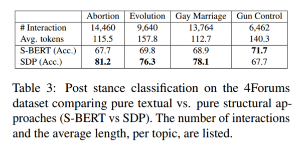

表三：在4Forums数据集上比较纯文本与纯结构化方法（S-BERT与SDP）的立场分类。列出了每个主题的交互次数和平均长度。

内容与结构使用单模态方法，我们可以将内容和结构分开，并获得一些关于它们之间相互作用的有趣见解。（在话语长度方面）相互作用，例如堕胎，进化和同性恋婚姻主题中的相互作用，更好地被结构模型（如SDP）捕获，而表现出较长话语的不太强烈的相互作用，例如在Gun Control中，可以通过基于文本的嵌入（例如S-BERT）更好地捕获。在表3中提供了单模态结果沿着每个主题中的交互数量和令牌数量。

这种模式可以用几种方式来解释：（i）在互动性强但不太冗长的环境中，互动结构在表明立场方面变得更加重要。话语结构，包括答复的频率和网络等方面，成为使用者立场的有力指标，（ii）较长的论证与较稀疏的网络相关，因为参与要求更高。另一方面，较长的文本提供了更强的信号，可以被基于文本的模型利用。

这些结果表明，结构与内容为中心的模型的有效性也取决于会话动态，构成（本地）的社会背景。

以多模态的方式整合内容和结构信息在数据集、主题和会话动态上是鲁棒的。多模态方法将潜在的丰富文本内容置于相关的社会背景中。

------

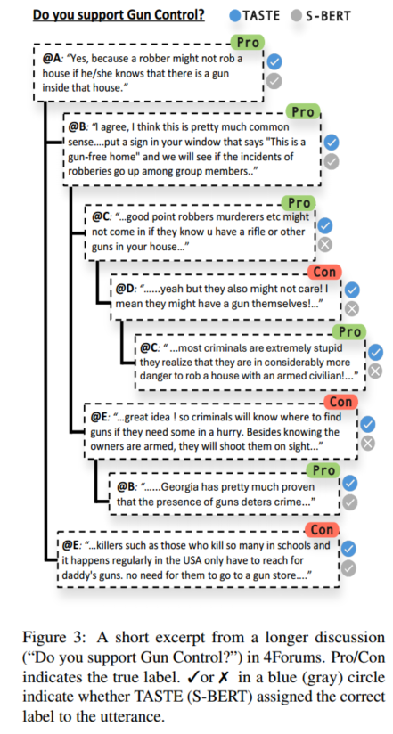

**图3：4Forums中较长讨论（“你支持枪支管制吗？”）的简短摘录。赞成/反对表示真实标签。蓝色（灰色）圆圈中的“否”或“否”表示TASTE（S-BERT）是否为话语分配了正确的标签。**

图3所示的交流为多模态框架的价值和SDP对理解讨论的全球结构的贡献提供了一个例子。在这个关于枪支管制的讨论中，参与者参与的互动模式比简单的话轮转换更复杂，其中每个评论都直接反对前一个。相反，参与者经常对其他人的评论做出回应，创造出一种微妙的动态，局部违反了最大切割假设，这种违反也可能影响评论的语气。C的第一个评论局部违反了最大切割假设，这是一个支持话语的例子，当脱离上下文时读起来相当模糊。

然而，通过将SDP的全局概览添加到模型中，它可以准确地捕获这些交互并正确地对参与者的立场进行分类，从而避免局部最大切割违规和话语的淡化语气。深入具体结果，仅依赖SBERT导致整个对话的准确率为71%，而我们最好的TASTE模型达到了92%的准确率。这一显著的改进强调了文本和结构嵌入相结合的有效性，以实现细微的立场检测。

节点嵌入：SDP vs. node2vec使用SDP获取节点嵌入被证明比更传统的node2vec方法优越上级，性能增益在0.09到0.17之间。

我们将性能差异归因于两个因素：（i）node2vec在比我们数据集中的会话网络大得多的网络上表现最好，（ii）node2vec方法旨在最小化相邻节点之间的距离，而在我们的情况下，我们实际上试图将它们分开，因为直觉上它们反映了相反的立场。SDP，另一方面，设计通过最大切割精确地实现这一点。

融合策略我们考虑了一种简单但常用的融合策略，即表示的串联（参见附录A中的表4中的结果）。使用GRN层显著优于跨所有主题的连接。结果中的这种显著差异可以归因于GRN层谨慎地将内容和结构嵌入的不同属性联合收割机组合的能力。与简单的连接不同，GRN层仅仅是合并或添加信息，而GRN层应用了一种更微妙的方法。

它有效地“门控”每个嵌入的信息，允许选择性的整合过程。这种门控机制在处理较小和噪声较大的数据集时特别有利，其中识别相关信息至关重要。

GRN层关注来自内容和结构数据的最相关特征的能力导致更准确和鲁棒的姿态检测模型。

姿势和话语数在作者水平上检查关于每个用户的话语数的TASTE的错误率，我们观察到，仅具有一个或两个话语的用户的错误率是平均错误率的1.5倍，并且比具有二十个或更多话语的用户的错误率高一个数量级（下降到只有0.05）。然而，即使在话语数量较少的用户上，TASTE也优于其他模型。这些结果再次证实了我们的直觉：尖锐的立场差异反映在对话动态上。对话越激烈-用户发出的话语越多（高参与度），在两种模式中都发出了更强的信号。

然而，即使在一个或两个话语的贡献被削减的情况下，结构嵌入也增强了信号。

TASTE和其他模型之间的性能差距在作者级别上明显小于在帖子级别上。这可以通过推理阶段方法来解释，该方法通过对所有帖子的多数投票来确定用户的立场。

因此，如果一个模型准确地预测了用户帖子的大多数立场，那么它就可以为该用户实现完美的准确性，这比正确地分类同一用户的每个帖子更难。因此，后一项任务在突出模型之间的性能差异方面更有效。
