# 标签掩蔽蒸馏的联邦学习FedLMD

## 一、介绍

### 传统联邦学习存在的问题

在经典的FL算法fedag中，对上传的模型参数进行加权平均，隐式交换各客户端的知识。当客户机中的数据分布相同时，它可以很好地工作。然而，实际的数据分布在不同的客户端之间通常是不同的，即非独立的等分布（Non-IID）。这意味着各种客户端模型的优化目标差异很大，服务器端模型的优化难度更大，甚至可能无法收敛。在本文中，我们关注一个更具体的情况，即**标签分布倾斜**。

**例如**，疾病可以根据严重程度简单地分为几类标签，与大医院相比，农村地区的小诊所通常有更多的小疾病病例，但很少或没有严重疾病病例。为方便起见，我们将这种实际情况称为**标签异构**情况。

为了解决标签分布倾斜和标签异构问题，提出了FedAvg(FedAvg是最著名的聚合策略之一联邦平均——聚合策略)和现有的客户端方法通常对模型输出或模型参数本身的约束进行正则化。

以上两个方法虽然缓解这一挑战，但不能有效利用大标签异质下客户端不同标签分布的有用信息。

- 标签分布倾斜：在数据集中，不同标签出现的频率存在较大差异，即某些标签的样本数量远远多于其他标签。
- 标签异构：不同客户端之间标签分布的差异。不仅是标签出现频率的不同，还包括标签对应的实际数据特征在不同客户端间的差异。
- 标签异质：与标签异构概念相近，同样强调标签在不同客户端之间的性质差异。这种差异包括标签分布的不均匀性以及不同客户端对标签的不同特征表现等多个方面。例如在一个自然语言处理任务中，不同客户端对同一类情感标签（如 “积极” 情感）的表达可能使用不同的词汇、句式等，同时不同客户端各类情感标签的数量分布也可能不同。

**在标签异质性情况下，学习到的模型容易偏向大多数类标签，而忘记少数类标签**。例如，一个地区的医疗数据客户端只有某些常见疾病（多数类标签）的数据，而缺少一些罕见疾病（少数类标签）的数据，那么在这个客户端上训练的疾病诊断模型就可能会偏向于常见疾病的诊断，而对罕见疾病的诊断能力较差。

**为此提出来标签掩蔽蒸馏的联邦学习FedLMD**

### 标签掩蔽蒸馏的联邦学习FedLMD介绍

FedLMD:通过利用来自服务器的全局模型来保留少数类标签（即客户端缺失的那些类标签）的知识.

服务器的全局模型是基于多个客户端的数据进行训练的，可能包含了更全面的类标签知识。通过某种机制（如知识蒸馏等技术，从论文后续内容可知），将全局模型中关于少数类标签的知识传递给客户端模型，使得客户端模型能够学习到这些缺失的知识，从而减少模型对已有部分类标签的偏向，提高模型的准确性和泛化能力。

## 二、方法

### 1、问题设置

经典的监督FL(联邦学习)系统，包含1个服务器和K个客户端。第K个客户端的本地数据集DK={(xi,yi)} 、模型参数wk。

FL通过对所有客户端的联合训练，获得一个全局模型：

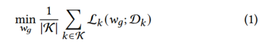

其中wg为全局模型的权重，Lk为训练第k个客户端模型的损失函数。在服务器端，FL系统聚合所有上传的模型权重。在每一轮通信中，指定K中的客户端来训练和上传参数，其中|K |为要上传的模型数量。

### 2、标签掩蔽蒸馏

所有类标签分为 **多数类标签**和 **少数类标签**

当nk,y>=(nk/nk,y), 类标签y是第k个客户端中的多数标签。nk是所有类别的样本总数，nk,y是第k个客户端中类别y的样本数量

以下，假设第k个客户端上的多数标签都在yk中

**知识蒸馏**：将一个较大、较复杂的教师模型的知识传递给一个较小、较简单的学生模型。让学生模型的输出尽可能接近教师模型的输出，除了最终的预测结果外，教师模型在中间层和输出层包含的知识（**暗知识**）也可传递给学生模型。

最终目的：最小化损失函数

#### (1)**FedLMD第K个客户端损失函数Lk**

FedLMD中将基于多个客户端模型更新的**全局模型视为教师模型**，**本地模型视为学生模型**，**第K个客户端的损失函数**如下：

其中 LCE 为学习大多数标签知识的交叉熵损失，Lkd为保留所有标签知识的蒸馏损失。在这里，我们将LCE的权值固定为1，并使用时延β作为加权因子来控制蒸馏损失。第k个本地模型的输出为 pk，全局模型的输出为pg，1y 是y的独热向量形式。

**独热向量**：对于一个具有n个类别的分类问题，独热向量是一个长度为n的向量。在这个向量中，只有一个元素为1，其余元素都为0。

例如，在一个三类分类问题（类别分别为 A、B、C）中：

o 如果样本属于类别 A，那么它的独热向量表示为[1,0,0]。

o 如果样本属于类别 B，其独热向量为[0,1,0]。

o 如果样本属于类别 C，对应的独热向量则是[0,0,1]。

**对于训练样本（xi，yi）∈(Xk,Yk)，xi是样本数据，yi 是样本标签，1y 中y是（xi，yi)的yi表示样本标签。**

#### (2)FedLMD第K个客户端交叉熵损失LCE

交叉熵损失：处理分类问题中常用的一种损失函数，主要用于度量两个概率分布间的差异性。在机器学习中，交叉熵表示真实概率分布与预测概率分布之间的差异。其值越小，模型预测效果就越好。

**二分类交叉熵表达式**：

#### (3)FedLMD知识蒸馏损失LKD

最常见的**知识蒸馏损失函数**基于KL散度，假设学生模型输出概率分布为Ps=（Ps1,Ps2,.............,Psn),教师模型的输出概率分布Pt=(Pt1,Pt2,.............,Ptn) ,n为类别数。

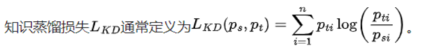

当学生模型的输出概率分布与教师模型的输出概率分布接近，LKD的值越小。

- Pti/Psi=1,log(Pti/Psi)=0,说明教师模型和学生模型对类别i的预测概率相同，模型一致。
- Pti/Psi**>**1,log(Pti/Psi)>0,说明教师模型对类别i的预测概率**大于**学生模型对类别i的预测概率，模型不接近，损失函数会增加，使得学生模型训练时**提高**对类别i的预测概率。
- Pti/Psi<1,log(Pti/Psi)<0,说明教师模型对类别i的预测概率**小于**学生模型对类别i的预测概率，模型不接近，损失函数会减小，使得学生模型训练时**降低**对类别i的**过高**预测概率。

##### FedLMD知识蒸馏损失存在问题

LKD 可以从第k个数据中学习并辅助偏向少数类标签，但它在进行**正则化时没有考虑客户端之间不同的标签分布**，导致次优优化。

不同客户端标签分布差异的体现：

o 在联邦学习环境下，不同客户端的数据是独立的，并且可能存在标签分布的差异。比如，在一个图像分类任务中，一个客户端可能主要包含某几种动物的图片（如猫、狗），这些标签在该客户端的数据中占比较大；而另一个客户端可能主要是植物的图片（如玫瑰、向日葵），其标签分布与第一个客户端完全不同。

#### (4)改进的LKD-***标签屏蔽蒸馏损失LLMD***

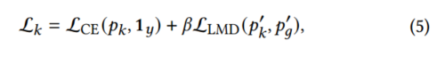

**其中，标签屏蔽蒸馏损失LLMD定义为p'k和p'g之间的KL散度**

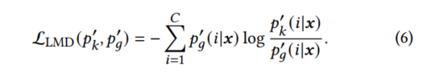

其中p'k和p'g分别为修改后的学生模型的概率分布和教师模型的概率分布。

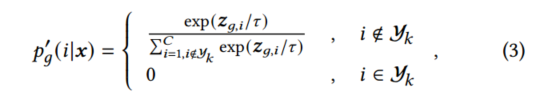

- Zg,i：全局模型针对第i类标签的对数几率，π 是一个温度系数
- C是类别总数， yk 是第K个客户端中**多数标签集合**
- exp：以自然常数e为底的指数函数，exp(x)表示e的x次幂，e2.71828
- 对数几率：在将模型的原始输出经过激活函数（如 Softmax 函数）转换为概率之前的值。对于一个分类任务，如果有n个类别，模型的对数几率通常是一个n维向量z=(z1,z2,........,zn)。

**将教师模型对数几率中的多数类标签部分屏蔽（设为0）**

促使学生模型从少数类标签（或者并非所有标签）的知识中学习，并有助于防止遗忘这些知识。

------

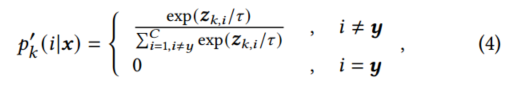

- Zk,i：客户端模型（学生模型)针对第i类标签的对数几率。
- i != y表示i类标签不是目标标签

**目标标签**：在模型训练过程中，与当前输入数据对应的真实标签。例如，在一个图像分类任务中，如果输入一张猫的图片，那么猫这个类别标签就是目标标签。

**将学生模型中的多数目标标签屏蔽掉**

此外，对于多数非目标标签，通过从**负监督中学习**，学生模型的表现可以得到进一步提升。

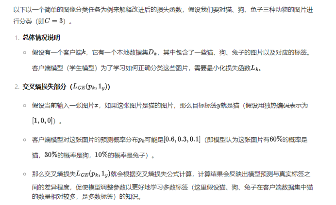

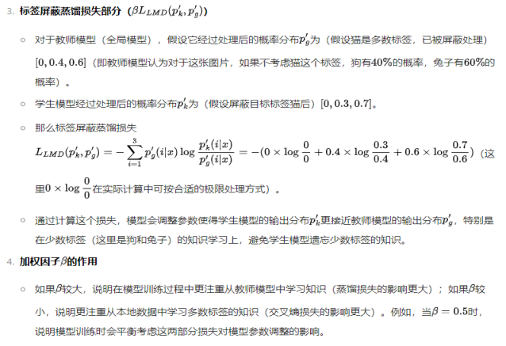

#### (5)无教师模型变体—FedLMD-tf

FedLMD 为每个客户端引入了一个额外的模型，这无疑会增加客户端的硬件开销。因此，我们考虑舍弃教师模型以避免成本。蒸馏中的教师模型通常需要预训练，以便它们能够更好地为学生模型提供知识。然而，联邦学习是一种在线学习，即教师模型在初始阶段并没有良好的性能。

通过引入固定的少数标签分布来取代教师模型的输出，将**蒸馏**视为**标签平滑（LS）正则化**。具体来说，我们将式7中的 P'g 替换为u k：

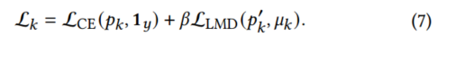

第k个客户端的固定少数类标签分布为:

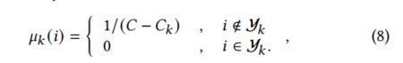

C和Ck分别表示类别标签的总数和第K个客户端的多数类标签的数量。

详细的训练过程：

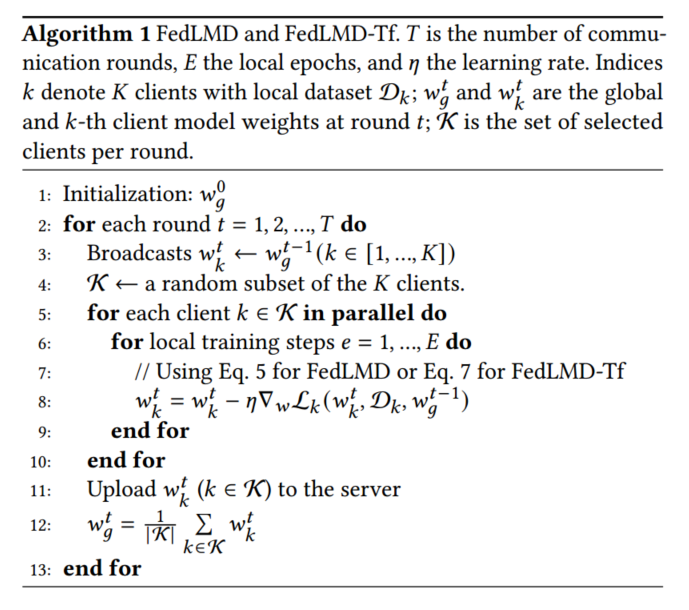

## 三、实验

使用了四个数据集，MNIST 、CINIC10 、CIFAR - 10 和 CIFAR100 。数据集分别使用两种非独立同分布（Non - IID）划分策略进行切片：1）分片（Sharding）[28]：数据根据标签进行切片，切片后的数据称为一个分片。每个分片具有相同数量的样本，数据异构性的程度由每个客户端拥有的分片数量决定。我们将设置为 MNIST（）、CIFAR - 10（）、CIFAR - 100（）和 CINIC - 10（）。

2）潜在狄利克雷分配（Latent Dirichlet Allocation，LDA）[20]：数据集通过狄利克雷采样进行切片，这为每个客户端提供了不平衡的标签和不平衡的样本。

不同客户端的数据异构性程度通过控制来确定。我们将设置为 MNIST（）、CIFAR - 10（）、CIFAR - 100（）和 CINIC - 10（）。

